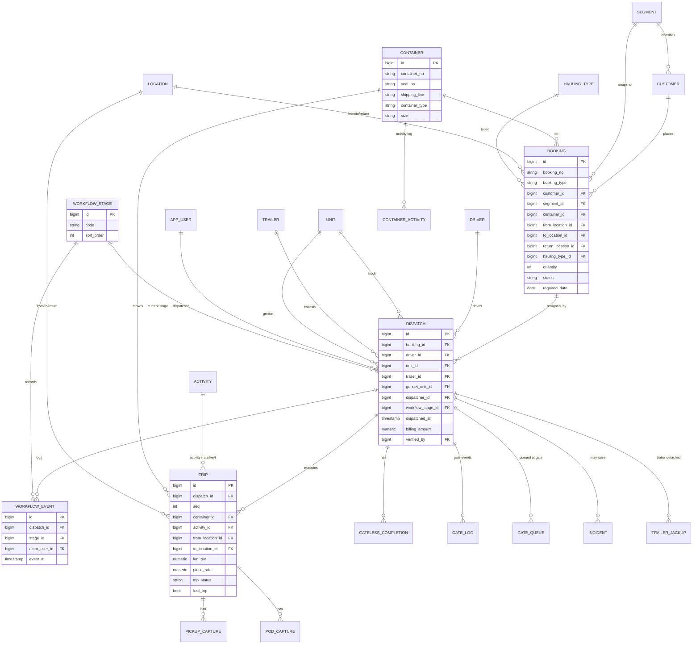
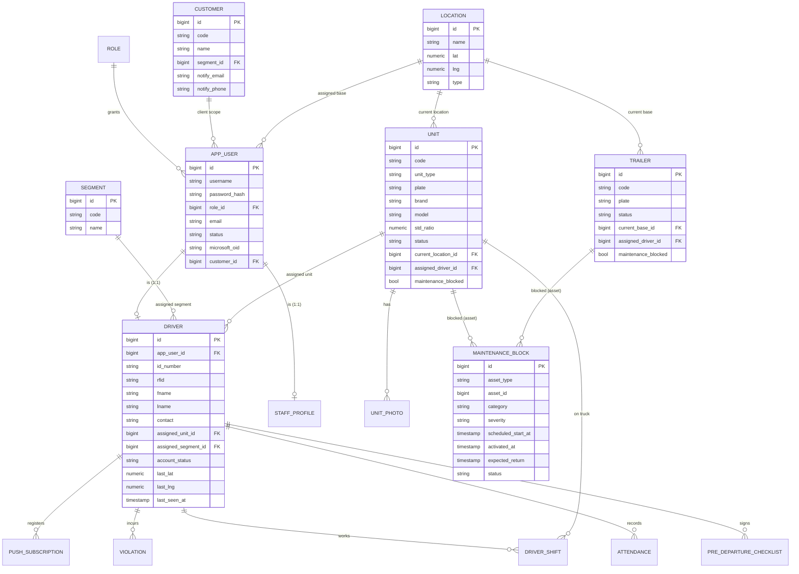
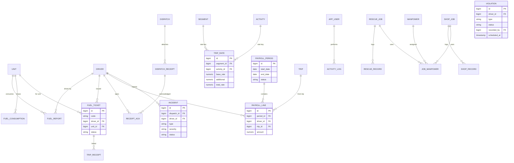

# Pantrucks Fleet Management — Normalized Data Model & ERD

Target data model for the rebuild. The current schema (see
[REBUILD-SPEC.md](REBUILD-SPEC.md) §4) is heavily **denormalized** — it stores
names as strings (`d_truck`, `d_trailer`, `costumer`, `hauling_segment`,
`trip_from`) instead of foreign keys, duplicates the same fact across
`booking`/`dispatch`/`trips`, and has per-customer copy tables. This document
replaces that with a normalized relational model.

---

## 1. Normalization principles applied

| Current (denormalized) | Normalized replacement |
| --- | --- |
| `dispatch.d_truck`, `d_trailer`, `d_genset` (name strings) | `dispatch.unit_id`, `trailer_id`, `genset_unit_id` (FKs → `unit`/`trailer`) |
| `dispatch.d_drivername` + `driver_id` | `driver_id` FK only (name is derived) |
| `booking.costumer`, `trips.costumer` (name strings) | `customer_id` FK → `customer` |
| `customer_segment` string copied everywhere | `segment_id` FK → `segment`; snapshot only where legally needed |
| `trip_from`, `trip_to`, `return_location` strings | `from_location_id`, `to_location_id`, `return_location_id` FKs → `location` |
| `hauling_segment`, `hauling_type` strings | `hauling_type_id` FK; segment via `segment_id` |
| `container_activity` string | `activity_id` FK → `activity` |
| 4 photo columns on `units` | `unit_photo` child table (view, path) |
| Container no./seal repeated on booking/trip/monitoring | `container` entity, referenced by FK |
| `reefer_monitoring` + per-customer monitoring copies | one `container_monitoring` keyed by `segment_id` |
| `user_type` free-text string | `role_id` FK → `role` |
| Staff (`"user"`) and driver auth split, names duplicated | unified `app_user` credentials; `driver` 1:1 to `app_user` |
| Laravel scaffold tables, `users` | dropped |
| `pt_pg_escape` inline SQL | (implementation) parameterized queries / ORM |

**Conventions:** every table has a surrogate `id BIGINT` PK; FKs named
`<entity>_id`; timestamps `created_at`/`updated_at`; soft-delete via
`deleted_at` where history matters; enums as small lookup tables (`role`,
`segment`, `workflow_stage`, `activity`, `hauling_type`) so values are
constrained and joinable.

---

## 2. ERD — core operational spine

The booking → dispatch → trip pipeline and its captures.



## 3. ERD — identity, fleet & reference



## 4. ERD — fuel, billing, payroll, HR, shop



---

## 5. Normalized table list (complete)

Legend: **PK** primary key · *FK* foreign key. All tables also carry
`created_at` / `updated_at` unless trivial.

### Identity & access
| Table | Key columns | FKs |
| --- | --- | --- |
| `role` | **id**, code, name, description | — |
| `app_user` | **id**, username, password_hash, email, status, microsoft_oid, microsoft_tenant_id, microsoft_linked_at | *role_id*, *customer_id* (nullable, for Client) |
| `staff_profile` | **user_id** (PK+FK), fname, lname, mname, image | *app_user_id*, *assign_location_id* |
| `driver` | **id**, id_number, rfid, fname, lname, mname, contact, image, signature, status, account_status, last_lat, last_lng, last_seen_at, shift_started_at, shift_ended_at | *app_user_id*, *assigned_unit_id*, *assigned_segment_id*, *base_location_id* |

### Reference / dictionaries
| Table | Key columns | FKs |
| --- | --- | --- |
| `segment` | **id**, code (ABC/DOLE/SUMI/CTH/DM/FARM), name | — |
| `customer` | **id**, code, name, notify_email, notify_phone | *segment_id* |
| `location` | **id**, name, lat, lng, type (base/port/CY/site) | — |
| `hauling_type` | **id**, name | *segment_id* (nullable) |
| `activity` | **id**, name (container activity; drives rate) | — |
| `workflow_stage` | **id**, code, label, sort_order | — |

### Fleet assets
| Table | Key columns | FKs |
| --- | --- | --- |
| `unit` | **id**, code, unit_type (truck/genset), plate, brand, model, year, engine_no, chassis_no, fuel_type, capacity, std_ratio, or_no, cr_no, status, maintenance_blocked | *current_location_id*, *assigned_driver_id* |
| `unit_photo` | **id**, view (front/left/right/back), path | *unit_id* |
| `trailer` | **id**, code, plate, status, current_base, maintenance_blocked | *current_base_id*, *assigned_driver_id* |
| `maintenance_block` | **id**, asset_type, asset_id, category, severity, reason, photo, scheduled_start_at, activated_at, expected_return, released_at, cost_labor, cost_parts, status | *blocked_by*, *released_by* |
| `trailer_movement` | **id**, status, type, location, container, remarks, moved_at | *trailer_id*, *driver_id*, *recorded_by*, *approved_by* |

### Containers, bookings & dispatch
| Table | Key columns | FKs |
| --- | --- | --- |
| `container` | **id**, container_no, seal_no, shipping_line, container_type (reefer/dry), size | — |
| `booking` | **id**, booking_no, booking_sn, booking_do, booking_type, dates (date/required/hauling_start/last_storage/last_demurrage/last_detention), vessel_name, voyage_no, bill_of_lading, port_location, customs_cleared(+at), quantity, quantity_use, status, client_notified_at | *customer_id*, *segment_id* (snapshot), *container_id*, *from_location_id*, *to_location_id*, *return_location_id*, *hauling_type_id* |
| `dispatch` | **id**, dispatch_ref, dispatched_at, cth_broker, cth_eir_out, cth_eir_in, decline_reason, gate_cleared_at, trip_started_at, trip_completed_at, billing_amount, billing_currency, billing_notes, billing_closed_at, client_notified_at, driver_accepted_at, driver_declined_at, verified_at, verification_notes | *booking_id*, *driver_id*, *unit_id* (truck), *trailer_id*, *genset_unit_id*, *dispatcher_id*, *hub_location_id*, *workflow_stage_id*, *verified_by* |
| `workflow_event` | **id**, notes, event_at | *dispatch_id*, *stage_id*, *actor_user_id*, *actor_role_id* |
| `trip` | **id**, seq, trip_type, km_run, departure_at, arrival_at, ph_arrival_at, deliver_at, withdraw_at, required_date, trip_status, segment_status, foul_trip, piece_rate, scheduled_at, cancelled_at, cancelled_reason, remarks | *dispatch_id*, *container_id*, *activity_id*, *from_location_id*, *to_location_id*, *return_location_id*, *deliver_location_id*, *withdraw_location_id* |

### Container tracking & captures
| Table | Key columns | FKs |
| --- | --- | --- |
| `container_monitoring` | **id**, status, priority, stage, location_tag, etd, cy_arrival, cy_departure, ph_arrival, ptsi, vessel_etd, week, remarks | *container_id*, *segment_id*, *driver_id* |
| `container_activity` | **id**, container_status, trip_status, remarks, recorded_at | *container_id*, *location_id*, *dispatch_id*, *driver_id* |
| `pickup_capture` | **id**, photo_path, lat, lng, captured_at | *trip_id*, *dispatch_id*, *driver_id*, *container_id* |
| `pod_capture` | **id**, photo_path, signature_path, signed_by, lat, lng, captured_at, verified_at, verification_notes | *trip_id*, *dispatch_id*, *driver_id*, *verified_by* |
| `gateless_completion` | **id**, lat, lng, accuracy_m, captured_at, synced_at, offline | *dispatch_id*, *trip_id*, *driver_id* |
| `trailer_jackup` | **id**, lat, lng, photo_path, detached_at, returned_at, billing_active | *dispatch_id*, *trailer_id*, *driver_id* |
| `hustling_record` | **id**, shift, xray, latag, inspection, ecd_on_dock, total_trips, remarks, signature | *driver_id*, *unit_id*, *trailer_id*, *recorded_by* |

### Gate
| Table | Key columns | FKs |
| --- | --- | --- |
| `gate_log` | **id**, direction, qr_payload, verified, mismatch_reason, authorised, logged_at | *dispatch_id*, *driver_id*, *unit_id*, *trailer_id*, *genset_unit_id*, *guard_user_id* |
| `gate_queue` | **id**, direction, requested_at, decision, decided_at, notes | *dispatch_id*, *driver_id*, *unit_id*, *decided_by* |

### Driver operations
| Table | Key columns | FKs |
| --- | --- | --- |
| `driver_shift` | **id**, started_at, ended_at, machine_hours, notes | *driver_id*, *unit_id*, *checklist_id* |
| `pre_departure_checklist` | **id**, fuel_ok, tyres_ok, lights_ok, cargo_ok, genset_ok, remarks, signed_at | *driver_id*, *unit_id*, *trailer_id*, *genset_unit_id* |
| `attendance` | **id**, control_no, status, time_in, time_out, date, remarks | *driver_id* |
| `message` | **id**, body, sent_at, read_at | *from_user_id*, *to_user_id*, *dispatch_id* |

### Fuel
| Table | Key columns | FKs |
| --- | --- | --- |
| `fuel_inventory` | **id**, po_no, liters, invoice, plate, consumable_ltr, consume_ltr, received_at | *unit_id* (nullable), *received_by* |
| `fuel_ticket` | **id**, code, date, status (Unused/Used) | *driver_id*, *unit_id* |
| `fuel_report` | **id**, date, last_hubo, hubo, calculated_hubo, km_run, liters, actual_ratio, std_ratio, excess_saving, hour_meter, control_no | *unit_id*, *driver_id*, *trip_receipt_id* |
| `fuel_consumption` | **id**, hubo, liters, date | *unit_id*, *driver_id* |

### Billing & receipts
| Table | Key columns | FKs |
| --- | --- | --- |
| `dispatch_receipt` | **id**, receipt_type, title, file_path, mime_type, requires_ack, attached_at | *dispatch_id*, *attached_by* |
| `receipt_ack` | **id**, acknowledged_at | *dispatch_receipt_id*, *driver_id* |
| `trip_receipt` | **id**, control_no, tr_number, total_km, map_total_km | *fuel_ticket_id*, *from_location_id*, *to_location_id* |

### Payroll (piece-rate)
| Table | Key columns | FKs |
| --- | --- | --- |
| `trip_rate` | **id**, base_rate, additional, total_rate (generated), effective_from — unique(*segment_id*,*activity_id*) | *segment_id*, *activity_id* |
| `payroll_period` | **id**, start_date, end_date, status | — |
| `payroll_line` | **id**, amount, control_no | *period_id*, *driver_id*, *trip_id* |

### HR / compliance
| Table | Key columns | FKs |
| --- | --- | --- |
| `violation` | **id**, type, description, status (Active/Scheduled/Done), date, done_date, scheduled_at | *driver_id*, *recorded_by* |
| `incident` | **id**, type, severity, description, lat, lng, photo, assistance, status, reported_at, resolved_at | *dispatch_id*, *trip_id*, *driver_id*, *reassigned_dispatch_id* |

### Shop / rescue
| Table | Key columns | FKs |
| --- | --- | --- |
| `rescue_job` | **id**, start_at, end_at, km, status | *unit_id*, *driver_id* |
| `rescue_record` | **id**, description, recorded_at | *rescue_job_id* |
| `shop_job` | **id**, start_at, end_at, remarks, status | *unit_id*, *driver_id* |
| `shop_record` | **id**, description, recorded_at | *shop_job_id* |
| `manpower` | **id**, fname, lname, mname, role, status | — |
| `job_manpower` | **id** | *rescue_job_id* (nullable), *shop_job_id* (nullable), *manpower_id* |

### Notifications & audit
| Table | Key columns | FKs |
| --- | --- | --- |
| `push_subscription` | **id**, endpoint, p256dh_key, auth_key, user_agent, last_used_at | *driver_id* |
| `push_send_log` | **id**, channel, subject, body, outcome, error, sent_at | *to_user_id*, *dispatch_id* |
| `activity_log` | **id**, actor_name, action, detail, created_at | *user_id*, *role_id* |

---

## 6. Notes on relationships & integrity

- **Genset as a unit:** modeled as `unit.unit_type = 'genset'`; `dispatch` and
  `pre_departure_checklist` reference it via a distinct `genset_unit_id` FK to
  the same `unit` table (self-referential role, not a separate table).
- **Snapshot vs reference:** `booking.segment_id` and `trip.piece_rate` are
  **intentional snapshots** (segment at booking time, rate at dispatch time) —
  keep them denormalized on purpose for historical accuracy. Everything else is
  a live FK.
- **Polymorphic assets:** `maintenance_block` and `job_manpower` reference
  either a unit/trailer or rescue/shop job. Two nullable FKs (with a CHECK that
  exactly one is set) are preferable to a `type`+`id` pair if your DB/ORM
  supports it cleanly.
- **Add DB constraints the old schema lacked:** real FOREIGN KEY constraints,
  NOT NULL where required, UNIQUE on natural keys (`unit.code`, `trailer.code`,
  `container.container_no`, `booking.booking_no`, `fuel_ticket.code`,
  `trip_rate(segment_id,activity_id)`), and CHECK constraints on enum-ish
  columns not moved to lookup tables.
- **Indexes:** FKs, `dispatch.workflow_stage_id`, `dispatch.dispatched_at`,
  `trip.dispatch_id`, `container_monitoring.segment_id`, and the
  `violation(driver_id, status)` filter used by the dispatch guard.
```
