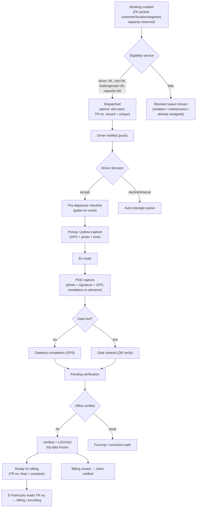

# Process Recommendations — Booking → Dispatch → Completion

Recommendations for the core operational lifecycle, based on the actual current
handlers (`addbooking.php`, the 464-line `assign_booking.php`,
`driver_accept_job.php`, `save_pod.php`, `approve_trip.php`, `close_billing.php`)
and the E-Pantrucks billing handoff. Pairs with
[REBUILD-SPEC.md](REBUILD-SPEC.md), [DATA-MODEL.md](DATA-MODEL.md), and
[INTEGRATION-EPANTRUCKS.md](INTEGRATION-EPANTRUCKS.md).

---

## 1. The lifecycle today (as-is)

```
BOOKING                DISPATCH                     EXECUTION (driver)              COMPLETION / BILLING
────────               ────────                     ──────────────────              ────────────────────
Encoder/client   →  Dispatcher assigns          →  Accept → checklist → pickup  →  POD → (gate*) → delivered
creates booking     driver+truck+trailer+genset    → en_route → POD/gateless        → pending_verification
(qty tracked)       + trip-receipt no.             (offline-capable)                → office verifies (approve)
                    guards: violation, maint.,                                       → billing_closed
                    dispatch-block, qty, assign                                      → client_notified
                                                                                     → E-Pantrucks reads TR no.
                                                                                        for billing/encoding
* gate module is dormant today; trips complete via gateless.
```

**What already works well — keep it:**
- Dispatch **guard checks** are thorough (`assign_booking.php`): active-violation
  block, maintenance-block, dispatch-block, booking quantity remaining, and
  unit-already-assigned — all inside a DB transaction.
- **Partial assignment** via `quantity` / `quantity_use` (one booking → many
  dispatches).
- **Piece-rate stamped** on the trip at creation (rate integrity).
- **Offline-first** driver captures with an idempotent replay queue.
- **Append-only `workflow_event`** log per transition.

---

## 2. Recommended lifecycle (to-be)



---

## 3. Stage-by-stage recommendations

### 3.1 Booking — fix data quality at the source
This is the **highest-leverage change**, because bad booking data silently
breaks billing downstream (E-Pantrucks drops a trip from billing when its
location isn't in the master).

- **Replace free-text with FK-backed pickers.** Today `costumer`, locations,
  hauling segment are typed strings. Make customer, pickup/delivery/return
  **location**, and segment **selected from masters** (typeahead), validated on
  save — reject unknown values instead of storing a typo.
- **Reserve capacity atomically.** `quantity_use` is a hand-incremented counter;
  two dispatchers can over-assign the last slot. Use a row lock
  (`SELECT … FOR UPDATE`) or an atomic conditional update
  (`UPDATE … SET quantity_use = quantity_use + 1 WHERE quantity_use < quantity`)
  so the slot claim is race-safe.
- **Enforce `booking_no` uniqueness** and a duplicate check (E-Pantrucks already
  has `operations_waybill_exists()`-style logic — mirror it here).
- **Explicit booking status** (`open → partially_assigned → fully_assigned →
  closed/cancelled`) driven by the capacity math, not free text.

### 3.2 Dispatch — centralize the rules, harden the keys
- **One eligibility service.** The guard logic lives inside `assign_booking.php`
  and is duplicated across `assign_bookingCTH.php`, `assign_booking_dnd.php`,
  `assign_service_trip.php`. Extract a single `canAssign(driver, unit, trailer,
  genset, booking)` that every assign path calls, so a rule added once (e.g.
  license expiry, insurance) applies everywhere. Add checks the current flow
  lacks: **driver license/ID expiry**, **document validity**, **shift/hours**.
- **Trip-receipt number is the billing join key — treat it as sacred.** It is
  what E-Pantrucks matches on (`dispatch.d_tripreceipt`). Generate it centrally,
  guarantee **uniqueness**, and validate format at issue time. A duplicate or
  blank TR no. means a trip can't be billed.
- **FK the assignment.** Store `unit_id`/`trailer_id`/`driver_id`, not
  name-strings (`d_truck`, `d_drivername`). Emit names to E-Pantrucks through
  the compatibility view (§ INTEGRATION doc) so the two systems still match by
  name but Fleet's own data is clean.
- **Make recall/decline first-class transitions** with an **auto-reassign
  queue** and a **decline timeout** (if a driver doesn't accept in N minutes,
  surface it for reassignment). You already have `stuck_assignments.php` — turn
  it into a monitored exception queue with alerts, not just a fetch.
- **Notify the driver on assignment** via the existing push channel.

### 3.3 Execution — enforce the state machine, capture the truth
- **Server-enforced transitions.** Make `workflow_stage` a real state machine:
  the server rejects an out-of-order jump (e.g. POD before accept). Today
  transitions are set piecemeal across many endpoints.
- **Mandatory capture to advance.** POD requires photo + signature + GPS before
  `delivered`; pickup/pullout requires GPS + photo. Don't let a trip complete
  with empty evidence.
- **Stamp real timestamps, not entry times.** `pickup_capture.captured_at` and
  POD capture time are the *actual* event times (and feed E-Pantrucks' pullout
  arrival/departure). Keep `captured_at` distinct from `synced_at` on every
  queued capture so offline replay doesn't distort the record.
- **Keep the offline queue + idempotency** exactly as designed — it's a strength.

### 3.4 Completion, verification & billing handoff
- **Verification freezes the trip.** After `approve_trip`, **lock** the trip's
  billable fields (like E-Pantrucks freezes a generated invoice). Later edits go
  through an explicit correction/foul-trip path, never silent overwrites.
- **Add a "ready for billing" gate.** On verify, confirm the trip-receipt record
  is complete (TR no., driver, unit, locations, container, km, activity/rate)
  and flag it **ready**. E-Pantrucks currently pulls whatever exists; a
  readiness flag tells the encoder/biller "this is final," cutting re-work and
  premature encoding.
- **Only stamp piece-rate on finalized trips**, or clear it on cancel, so
  cancelled/foul trips don't leak into payroll.
- **Close the loop to the client** (portal + notification) on completion — the
  fields already exist (`client_notified_at`).
- **Show drivers a "pending verification" earnings line.** Today the driver
  dashboard counts **only verified trips** toward earnings (`SUM(piece_rate)` on
  verified dispatches, per the 6→20 / 21→5 cutoff) — correct for integrity, but
  it means a driver finishes trips and **doesn't see the pay until the office
  verifies**, which reads like missing money. In the rebuild, split the display
  into two figures: **Earned (verified) ₱X** and **Pending verification ₱Y**, so
  the driver sees earned-but-not-yet-confirmed amounts without them counting as
  final. This also gives drivers a reason to chase incomplete POD/paperwork
  (the thing blocking verification), and pairs with the verification-backlog SLA
  queue (§4) so pending amounts don't sit unverified for long.

---

## 4. Cross-cutting recommendations

1. **Single source of truth for shared master names.** Since E-Pantrucks is
   master for drivers/units/trailer/location/rates, sync those names/ids into
   Fleet (one-way) so dispatch selections always match what billing expects —
   eliminates the silent-blank auto-fill problem.
2. **Idempotency on every state-changing endpoint**, not just driver submits —
   reuse the proven `idempotency_key` pattern so a double-tap or retried assign
   never double-dispatches.
3. **Audit every transition** through `workflow_event` (actor, from→to stage,
   timestamp) and surface a **per-dispatch timeline** — you already have
   `workflow_timeline.php`; make it the canonical trace.
4. **SLA timers / exception queues** for each stage: unaccepted assignments,
   trips stuck in a stage too long, POD missing, verification backlog. Turn
   silent gaps into a worklist.
5. **Concurrency safety** on the shared counters and assignment (locks /
   conditional updates) — the biggest correctness risk in a multi-dispatcher
   setup.

---

## 5. Priority (what to do first)

| Rank | Change | Why |
| --- | --- | --- |
| 1 | FK-backed booking data + master validation (§3.1) | Bad source data silently breaks billing; fixes the root cause |
| 2 | Atomic capacity claim + assignment concurrency (§3.1–3.2) | Prevents over-assignment/double-dispatch |
| 3 | Unique, centrally-issued trip-receipt no. (§3.2) | It's the E-Pantrucks billing key — must be clean & unique |
| 4 | One eligibility service (§3.2) | Consistent guards across every assign path |
| 5 | Server-enforced workflow state machine (§3.3) | Stops out-of-order/incomplete completions |
| 6 | Verify-then-freeze + ready-for-billing flag (§3.4) | Clean, final data for E-Pantrucks; less re-work |
| 7 | SLA/exception queues + transition audit (§4) | Visibility; nothing falls through the cracks |

---

## 6. Service trips (non-booked routes) — recommendations

A **service trip** is a movement with no customer booking — repositioning, fuel
run, shop/maintenance visit, trailer pickup, return-empty. Current model
(`010_service_trips.sql`, `assign_service_trip.php`, `complete_service_trip.php`):
`trips.trip_purpose = 'Service'`, `dispatch.costumer = 'INTERNAL'` (sentinel,
excluded from billing), `booking_no = ''`, trip receipt **optional**.

**What's good:** the `trip_purpose` CHECK constraint, the `INTERNAL` sentinel
that keeps service trips out of billing, and reuse of the same assignment guards.

### Gaps in today's service-trip flow
- **The driver isn't in the loop.** The dispatcher assigns *and* the dispatcher
  closes it (`complete_service_trip.php`) — there is **no driver accept, no GPS,
  no capture, no real timestamps**. A service trip has zero evidence it actually
  happened or when.
- **`service_reason` is free text** (60 chars) — no controlled list, so you
  can't analyze *why* the fleet runs non-revenue kilometres.
- **Payroll is undefined** — service trips have no activity, so the piece-rate
  trigger stamps 0. If drivers should be paid for them, there's no mechanism.
- **No cost visibility** — service trips are pure cost (fuel, wear, driver time,
  no revenue) but that cost isn't measured.
- **No completion SLA** — a dispatcher must remember to close it; nothing flags
  a service trip left open.

### Recommendations
1. **Put the driver in the loop (lightweight).** Even without a POD, give the
   driver a minimal accept → start → arrive flow with **GPS + timestamps** (and
   optional photo for shop/trailer-pickup). Then completion reflects reality and
   feeds real times — reuse the existing driver-app capture + offline queue,
   just a simpler variant. Keep dispatcher-close as a fallback for trips the
   driver can't close.
2. **Controlled `service_reason` vocabulary** (→ a `service_reason` lookup / FK
   in the normalized model): Repositioning, Fuel Run, Shop/Maintenance, Trailer
   Pickup/Pullout, Return Empty, Rescue Support, Other. This makes non-revenue
   movement analyzable.
3. **Decide the payroll policy explicitly.** Either (a) unpaid — clear
   `piece_rate` to 0 on service trips (don't rely on "no activity"); or (b) a
   dedicated **service-trip rate** (flat or per-km) held in a small rate table
   separate from `trip_rate`. Make it a setting, not an accident.
4. **Count in utilization, exclude from revenue.** Ensure equipment/driver
   **utilization** reports *include* service trips (they consume the asset) while
   **billing/revenue** reports keep excluding them. Surface a **deadhead / non-
   revenue-km ratio** KPI — one of the most useful fleet metrics you're not
   capturing today.
5. **Billing exclusion is already solid — keep it that way.** ✅ Confirmed:
   **E-Pantrucks billing excludes service trips.** Billing is built from
   E-Pantrucks' own `operations` (encoder RV) records, and service trips are
   never encoded there (no booking/customer), so they never enter the billing
   universe — reinforced by the Fleet-side `INTERNAL` sentinel. No `trip_purpose`
   filter is needed in billing SQL because the data never arrives.
   *Residual nuance (low risk):* the **auto-fill lookup** (`lookup_trip_receipt`)
   joins `dispatch`+`trips` by trip-receipt number **without** a purpose filter,
   so a service trip that was given a 6-digit receipt *could* surface if an
   encoder typed that exact number. To make it airtight in the rebuild, either
   keep service-trip receipts out of the billable TR range or add
   `AND trip_purpose <> 'Service'` to the lookup — a belt-and-suspenders guard,
   not a current problem.
6. **Add a completion SLA / open-service-trip queue.** Auto-flag (or auto-close
   with a note) service trips left open past a threshold, so they don't linger
   as phantom in-progress trips.
7. **Capture km + fuel on service trips** so the true cost of non-revenue
   movement is measurable and attributable to the reason category.

> Net: service trips are currently a **thin dispatcher-only record**. Making them
> driver-tracked (GPS + times), reason-coded, cost-measured, and explicitly
> non-billable turns them from a blind spot into a source of real
> utilization/cost insight — without ever polluting customer billing.

---

> Net theme: **the current flow's logic is sound but fragile at the edges** —
> free-text data, name-string coupling, hand-incremented counters, and
> transitions scattered across endpoints. Normalizing the data, centralizing the
> rules (eligibility + state machine), hardening the trip-receipt key, and
> freezing verified trips turn it into a reliable pipeline that feeds E-Pantrucks
> clean data with far less manual correction.
