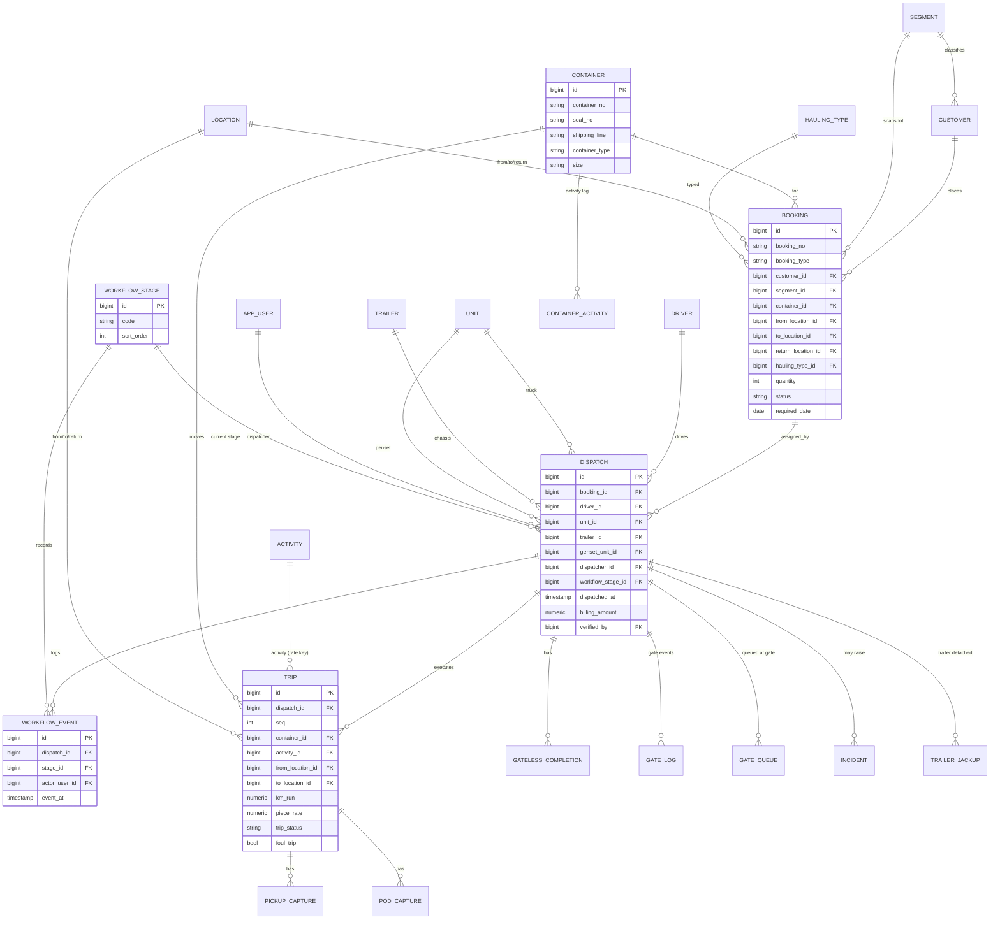
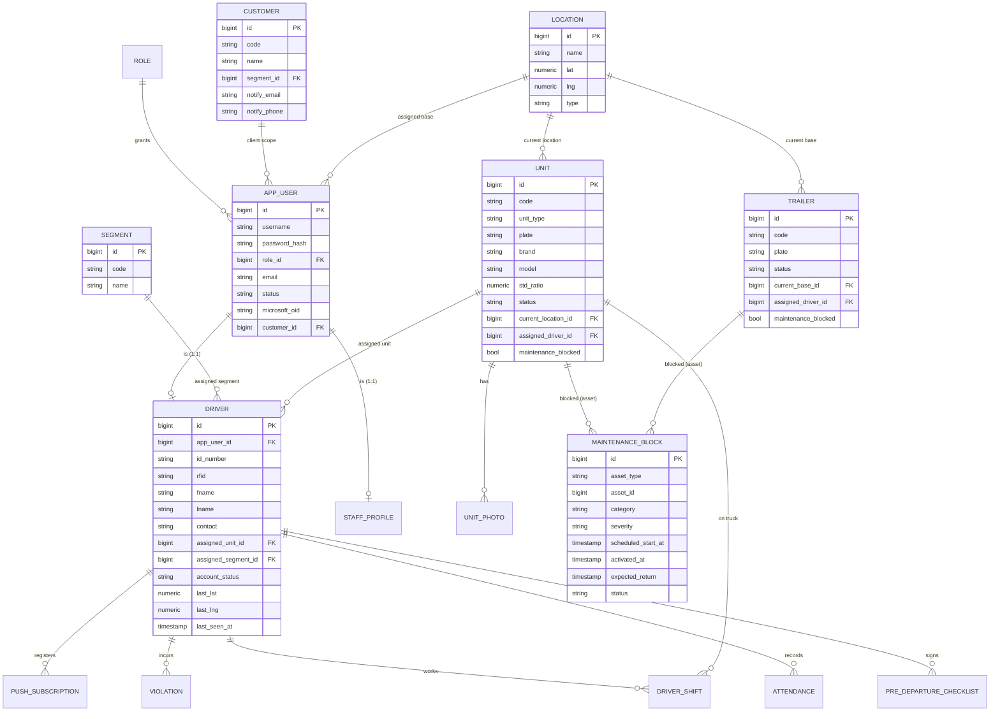
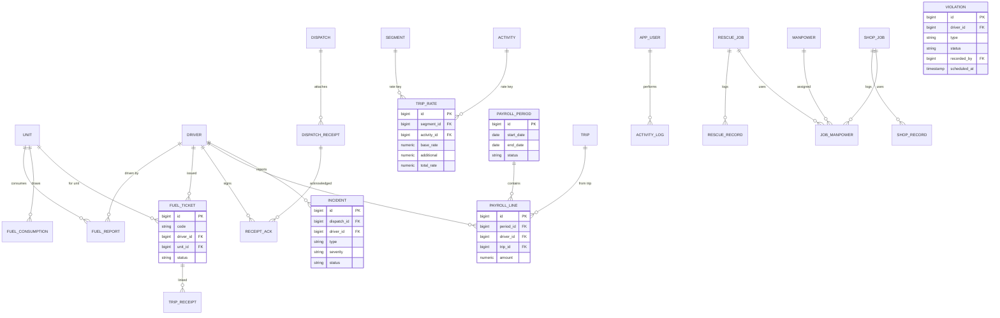
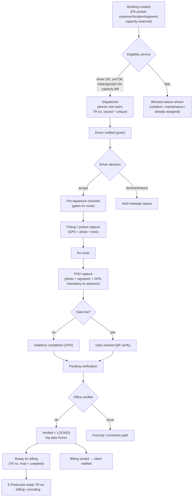

# Pantrucks Fleet Management — Rebuild Guide

The single, consolidated guide for building the next version of the Pantrucks
Fleet Management system. It merges five working documents into one reference:

1. **Rebuild Specification** — everything the current system does (roles, data
   model, features, workflow, integrations) and what to fix.
2. **Normalized Data Model & ERD** — the clean relational schema + diagrams for
   the new build (replaces the denormalized current schema).
3. **E-Pantrucks Integration** — how the new system feeds the E-Pantrucks
   billing/encoding app (they already share a database).
4. **Process Recommendations** — Booking → Dispatch → Completion (and service
   trips), grounded in the real handlers.
5. **Design** — modern UI/UX, tech stack, technical architecture, and structure
   for the new version.

> Companion files kept separate: [CLAUDE.md](CLAUDE.md) documents the **current**
> system's architecture/conventions; [CHANGES.md](CHANGES.md) is the phase
> history. This guide is about the **new** version.
>
> Note: each Part keeps its own section numbering; a cross-reference like "§4"
> refers to sections **within the same Part**.

---

## Table of contents

- **Part I — Rebuild Specification**
- **Part II — Normalized Data Model & ERD**
- **Part III — E-Pantrucks Integration**
- **Part IV — Process Recommendations**
- **Part V — Design** — modern design language (clean "operations SaaS" look,
  dark-mode-first, tokens, command palette), recommended stack (CodeIgniter 4 /
  Slim — **not Laravel** — + Postgres + Vue/PWA), architecture, structure,
  UI/UX, build order.

---


# Part I — Rebuild Specification


A complete, implementation-agnostic reference of everything the current system
does, so a new version can be built without reverse-engineering the old code.
Captures **data model, roles, features, business rules, workflows, and
integrations** as of 2026. Pair with [CLAUDE.md](CLAUDE.md) (architecture of the
current build) and [CHANGES.md](CHANGES.md) (phase history).

> **Domain:** container/reefer trucking & hauling for a Philippine logistics
> company (Anflocor / Pantrucks). Core job: move shipping containers between
> ports, container yards (CY), and customer sites with trucks (prime movers),
> trailers/chassis, and gensets (for reefers), tracked end-to-end.

---

## 1. System overview

| Aspect | Current build | Notes for rebuild |
| --- | --- | --- |
| Type | Multi-role web app + driver PWA + native Android wrapper | Keep the driver as a mobile-first PWA/app |
| Backend | PHP 8 (procedural, PDO), Apache/XAMPP | Any stack; the domain logic below is what matters |
| Database | PostgreSQL on Supabase | Relational; ~55 tables (see §4) |
| Frontend | Server-rendered PHP + Bootstrap 5, jQuery, DataTables, ApexCharts/Chart.js, Leaflet/MapTiler | SPA optional |
| Auth | Session-based; local password + Microsoft Entra SSO | 15 roles (see §2) |
| Realtime | Web Push (VAPID), polling AJAX, live GPS ingest | Consider websockets in rebuild |
| Integrations | Microsoft SSO, WhatsApp (violations), Web Push, Map tiles, Excel (PhpSpreadsheet) | See §7 |

---

## 2. Roles & permissions

15 user types. Staff/admin live in the `"user"` table; drivers in `drivers`.
Each role has its own landing page and menu.

| Role | Landing | Can do |
| --- | --- | --- |
| **Admin** | dashboard | Everything: bookings, dispatch, units, drivers, users, settings, reports, billing, payroll config |
| **Dispatcher** | dispatch dashboard | Bookings, dispatch/assign, monitoring, gate, driver ops — scoped to dispatch |
| **Dispatch Admin** | dispatch admin dashboard | Dispatcher + analytics/oversight |
| **Booker** | add booking | Create bookings only |
| **Client** | client portal | Self-service: book trips, view own bookings/containers (scoped by `customer_code`) |
| **Driver** | driver PWA | Accept/decline jobs, run trips, checklist, POD, incidents, earnings |
| **Gate-Guard** | gate dashboard | Gate check-in/out, verify QR, gate queue, incidents |
| **Gastender** | fuel ticketing | Issue fuel tickets, manage fuel inventory, fuel reports |
| **Payroll** | payroll dashboard | Assign piece-rate via coupon control no., close periods |
| **Maintenance** | maintenance dashboard | Block/unblock units & trailers, maintenance history |
| **Shop** | shop dashboard | Workshop repairs, manpower assignment |
| **Rescue** | shop dashboard | Breakdown rescue dispatch |
| **User (HR)** | HR dashboard | Driver performance, attendance, violations (read/report) |
| **HR-Admin** | HR Admin dashboard | HR + payroll + violation management (can block drivers) |
| **Visual** | analytics dashboard | Manager analytics, recommendations, performance dashboards |

**Account status:** `Pending` accounts are blocked until approved. Drivers have
a separate `driver_account_status`.

---

## 3. Core domain entities

- **Unit** = truck / prime mover (also stores gensets via `unit_type`). Has
  plate, OR/CR, brand, engine/chassis no., fuel std ratio, 4 photos, assigned
  driver/segment/trailer/genset, current location, maintenance-block state.
- **Trailer** (chassis) = separate asset; assigned to a truck/driver, tracked by
  location & base, has its own maintenance-block state; can be "jacked up"
  (detached) mid-trip.
- **Genset** = refrigeration unit for reefer containers (tracked as a unit type
  and on trips/dispatch).
- **Driver** = has RFID, license/ID number, contact, photo, signature, assigned
  unit/segment/base, live GPS (last_lat/lng/last_seen), shift state.
- **Customer** = has `customer_code` and `customer_segment` (ABC, DOLE, SUMI,
  CTH, DM, FARM…); segment drives monitoring views and trip rates.
- **Booking** = a haul request (container to move). Snapshots customer segment.
- **Dispatch** = assignment of a booking to driver + truck + trailer + genset.
- **Trip** = the actual movement executed under a dispatch (a dispatch can spawn
  multiple trip legs/segments). Carries the stamped `piece_rate`.
- **Container** = tracked through a lifecycle (pickup → on trip → delivered).

---

## 4. Data model (≈55 tables)

Primary keys are identity integers unless noted. Column prefixes indicate the
entity (`driver_*`, `unit_*`, `trailer_*`, `user_*`, `booking_*`, `d_*`,
`trip_*`). `"user"` must be quoted (Postgres reserved word).

### Identity & access
- **`"user"`** — staff accounts. Key cols: `user_name`, `user_pass` (hashed),
  `user_type` (role), `user_fname/lname/mname`, `user_email`,
  `user_assignlocation`, `customer_code` (links a Client to a customer),
  `user_accountstat`, Microsoft SSO: `microsoft_oid`, `microsoft_tenant_id`,
  `microsoft_email`, `microsoft_linked_at`.
- **`drivers`** — driver accounts + profile. `driver_idnumber`, `driver_rfid`,
  name fields, `driver_contact`, `driver_image`, `driver_signature`,
  `driver_assignunit/segment/base`, `driver_status`, `driver_uname`,
  `driver_pass`, `driver_account_status`, shift (`shift_truck`,
  `shift_started_at`, `shift_ended_at`), live GPS (`last_seen_at`, `last_lat`,
  `last_lng`), Microsoft SSO cols (added in phase 15).
- *(Laravel scaffold, unused: `users`, `sessions`, `password_reset_tokens`,
  `cache`, `cache_locks`, `jobs`, `job_batches`, `failed_jobs`, `migrations` —
  drop in rebuild.)*

### Fleet assets
- **`units`** — trucks/prime movers/gensets (full profile + maintenance block +
  `current_location`).
- **`trailer`** — chassis (assignment, location, `current_base`, maintenance
  block).
- **`trailer_jackup`** — a trailer detached mid-trip at GPS point; billing runs
  while `billing_active` until `returned_at`.
- **`trailer_movement`**, **`trailer_transaction`** — trailer movement/txn logs.

### Bookings & dispatch
- **`booking`** — the haul request. Rich: booking no/sn/do, dates
  (`booking_date`, required, hauling start, last storage/demurrage/detention),
  `costumer`, `customer_segment`, container + seal, activity, hauling
  segment/type, `trip_from`/`trip_to`/`return_location`, vessel/voyage/BL/port
  fields, `customs_cleared`(+at), `client_notified_at`, `quantity`/`quantity_use`,
  `status`.
- **`dispatch`** — assignment. `booking_no`, `dispatch_ref`, `d_datetime`,
  dispatcher/hub, `d_drivername`+`driver_id`, `d_truck`/`d_trailer`/`d_genset`,
  `d_tripreceipt`, `costumer`, **`workflow_stage`** (see §5), driver
  accept/decline timestamps + `decline_reason`, `gate_cleared_at`,
  `billing_closed_at`, `billing_amount`/currency/notes, `trip_started_at`,
  `trip_completed_at`, verification (`verified_by/at`, notes).
- **`trips`** — executed legs. `d_id`, type, trailer/genset, customer +
  `segment_costumer`, container type/no, activity, container status, hauling
  segment/type, from/to/return, `km_run`, departure/arrival/PH-arrival
  datetimes, deliver/withdraw location+datetime, `trip_status`,
  `segment_status`, `foul_trip`, cancelled at/reason, `scheduled_at`,
  `trip_seq`, **`piece_rate`** (stamped at insert by a DB trigger).
- **`hauling`** — hauling segment/type dictionary.
- **`location`** — named locations with lat/long.
- **`customer`** — code, name, `customer_segment`, `notify_email`,
  `notify_phone`.

### Container tracking
- **`container_monitoring`** — live tracking board (number, shipping line,
  location tag, status, priority, PM no., driver, ETD/CY-arrival/CY-departure/
  PH-arrival/PTSI timestamps, seal, vessel ETD, week, stage, remarks).
- **`container_activity`** — activity log per container (location, truck,
  trailer, genset, driver, container/trip status).
- **`reefer_monitoring`** — reefer-specific monitoring (van/PM no., ETD/arrival/
  departure dates, CIR, week, vessel ETD, customer ref).
- **`pickup_capture`** — driver photo + GPS at container pickup.
- **`pod_capture`** — proof of delivery: photo + signature + signer + GPS +
  verification.
- **`gateless_completion`** — trip completed without a gate (GPS-verified,
  supports offline sync).
- **`hustling_record`** — port "hustling" productivity (trips, x-ray, latag,
  inspection, ECD-on-dock counts per driver/shift).

### Gate
- **`gate_log`** — every gate in/out (direction, truck/trailer/genset codes,
  driver, QR payload, `verified`, `mismatch_reason`, `authorised`, guard).
- **`gate_queue`** — pending gate requests with accept/decide decision.
- **`outin`** — legacy in/out record (driver, truck, trailer, genset, segment,
  status).

### Driver operations
- **`driver_shift`** — shift session (truck, start/end, `machine_hours`, linked
  checklist `pdc_id`).
- **`drivers_attendance`** — attendance (control no., status, time in/out, date,
  VL/SL dates).
- **`pre_departure_checklist`** — fuel/tyres/lights/cargo/genset OK flags +
  remarks, per driver+truck.
- **`message`** — 2-way chat (from/to role+id, body, optional `d_id`, read_at).

### Fuel
- **`fuel_inventory`** — deliveries (PO no., liters, invoice, plate, consumable/
  consume liters).
- **`fuel_report`** — per-unit consumption (last/current hubo, km run, liters,
  actual vs std ratio, excess/saving, hour meter, control no., trip ticket,
  segment, transacted by).
- **`consume_fuel`** — per-unit fuel draw (hubo, liters).
- **`ticket_code`** — generated fuel ticket codes (`tc_code`, driver id, unit,
  status Unused/Used).

### Billing & receipts
- **`dispatch_receipt`** — files attached to a dispatch (type, title, path, mime,
  `requires_ack`, attached by/at).
- **`receipt_acknowledge`** — driver ack of a receipt.
- **`trip_receipts`** — trip receipt / control no. with km details.

### Maintenance
- **`unit_maintenance`** — block record: `unit_kind`(truck/trailer), `unit_code`,
  category, severity, reason, photo, `expected_return`, `scheduled_start_at`
  (for scheduled blocks), `activated_at`, blocked/released by+at, release notes,
  `cost_labor`/`cost_parts`, `status` (scheduled/active/released).

### Shop / rescue
- **`shop_unit`**, **`shop_record`** — workshop repair units + logs.
- **`rescue_unit`**, **`rescue_record`** — breakdown rescue units + logs.
- **`shop_manpower`**, **`assign_manpower`** — mechanics/helpers and their
  assignment to rescue/shop jobs.

### HR / compliance
- **`violation_record`** — driver violation (type, description, `vr_status`
  Active/Scheduled/Done, recorded by, date, done date, **`vr_scheduled_at`** for
  auto-activation). An **Active** violation blocks the driver from dispatch.
- **`incident`** — on-trip incident (type, severity, description, GPS, photo,
  assistance requested, reassigned dispatch, status open/resolved).

### Workflow, audit, notifications
- **`workflow_event`** — append-only pipeline event log (dispatch, booking,
  stage, actor role/id, notes, timestamp).
- **`update_log`** — fuel-report edit log.
- **Activity log** (via helper) — all user actions (login, CRUD, dispatch…).
- **`push_subscription`** — driver web-push endpoints (endpoint, keys, UA).
- **`push_send_log`** — every push attempt (to role/id, channel, subject, body,
  outcome, error).

### Payroll (piece-rate)
- **`trip_rates`** — rate lookup keyed by (`segment`, `activity`); `base_rate` +
  `additional` → generated `total_rates`. Unique on `LOWER(segment,activity)`.
- **`trips.piece_rate`** — stamped from `trip_rates` at trip insert via trigger
  `trg_trips_stamp_piece_rate`, so historical payroll is immune to later rate
  changes.

---

## 5. The workflow pipeline (most important business logic)

Every dispatch advances through an ordered set of **workflow stages** (stored in
`dispatch.workflow_stage`, each transition appended to `workflow_event`):

```
dispatcher_assigned
  → driver_accepted        (driver taps Accept in PWA)   |  driver_declined → reassigned
  → en_route               (driver starts trip; pre-departure checklist done)
  → gate_cleared           (gate guard verifies QR + truck/trailer/driver match)
                           ⚠️ gate module dormant today — this stage is
                           currently BYPASSED; trips complete via gateless
                           completion. Wire it back in when gate goes live.
  → pod_captured           (driver captures proof of delivery: photo + signature + GPS)
  → delivered              (container delivered / gateless completion)
  → pending_verification   (office verifies POD / trip data)
  → billing_closed         (billing amount finalized)
  → client_notified        (customer notified of completion)
```

Side/terminal states: `recalled` (dispatcher pulls back an assignment before
acceptance), `reassigned` (after decline or incident-driven reassignment).

**Rebuild note:** model this as an explicit state machine with allowed
transitions and an event log. The current build spreads transitions across many
operation files; centralize them.

---

## 6. Feature areas & business rules

### 6.1 Bookings
- Types: **Local**, **multi** (many containers at once), **CTH** (container/
  trailer haul with broker + EIR in/out fields).
- Booking numbers auto-generated (sequential, per scheme).
- Segment is snapshotted from the customer at creation (rates/monitoring depend
  on it).
- Clients can self-book via the portal (scoped to their `customer_code`).

### 6.2 Dispatch / assignment
- Assign driver + truck + trailer + genset to a booking. Flows: standard, CTH,
  drag-and-drop tile board, service trips.
- **Guards enforced at assignment:**
  - Driver with an **Active** violation → blocked (HR block).
  - Truck/trailer flagged **maintenance_blocked** → not assignable.
  - Truck can be explicitly **blocked** by dispatch (with unblock).
  - Unit availability / already-assigned checks.
- Recall an assignment before the driver accepts.
- Driver recommendation helper suggests eligible drivers.

### 6.3 Driver PWA
Accept/decline jobs; pre-departure checklist (gates `en_route`); update trip
status; capture **pickup** (photo+GPS), **POD** (photo+signature+GPS);
**gateless completion** (GPS, offline-capable); report **breakdown**, **jackup**
(detach trailer), **hustling** (port productivity); send **SOS**; **chat**;
view **earnings** (sum of stamped `piece_rate`) & payroll history. Live GPS
streamed to the server (`ingest_driver_gps`). Installable PWA + push.

### 6.3a Driver app — delivery model (PWA + native Android)

The driver experience ships **two ways over the same web codebase** (`driver/`):

**A. Installable PWA** (primary)
- Manifest [manifest.webmanifest](manifest.webmanifest): `id` `pantrucks-driver`,
  `start_url` `driver-dashboard`, `display: standalone`, portrait, themed.
- Service worker [sw-driver.js](sw-driver.js) + `driver/pwa-register.js`:
  offline caching of the driver shell, background sync, and **Web Push**
  handling (job offers, messages).
- Works on any modern mobile browser; "Add to Home Screen" installs it.

**B. Native Android wrapper** (`android-driver-app/`, Kotlin/Gradle)
- A **WebView shell** (`MainActivity.kt`) around the same driver pages — *not*
  a native rewrite. Single-activity, full-screen.
- Base URL is build-time configurable via `gradle.properties`
  (`DRIVER_APP_BASE_URL`, default `https://app.fleet-pantrucks.com/driver-dashboard`).
- Adds device capabilities the browser gates: **persistent login/session
  cookies**, **geolocation** prompts for live tracking, **camera + file
  upload** for POD / pickup / jack-up / breakdown captures, **pull-to-refresh**,
  Android back navigation, and routing downloads to Android's download manager.
- Config files: `AndroidManifest.xml`, `res/xml/file_paths.xml` (upload paths),
  `res/xml/network_security_config.xml` (allow http for LAN/XAMPP testing).
- A **Trusted Web Activity (TWA)** path is possible later via
  [.well-known/assetlinks.json](.well-known/assetlinks.json) but needs a stable
  HTTPS domain.

**Rebuild guidance:** keep the driver app as a mobile-first PWA and decide early
whether the native shell stays a WebView/TWA wrapper (cheap, one codebase) or
becomes a real native/React-Native/Flutter app (needed only if you want richer
offline, background GPS, or hardware integration). The capabilities the wrapper
currently exposes (camera, GPS, persistent session, downloads) are the
must-haves either way.

**Driver app screens / routes** (all under `driver-*`): dashboard, profile,
booking list, unit, checklist, POD, gateless, jackup, hustling, breakdown,
messages, receipts, earnings, payroll-history, trip-report, drivers-report.

### 6.4 Gate control — ⚠️ NOT CURRENTLY IN USE (planned for future)
> **Status:** The gate module is built but **not active in production today**.
> It is a **planned future feature** — keep it in the rebuild scope, but treat
> it as phase-2/optional, not part of the initial live cutover. Because it is
> dormant, dispatches today complete via **gateless completion** (GPS-verified,
> §6.3) rather than passing through `gate_cleared`. Do not let gate absence
> block the workflow.

Guard scans a QR (dispatch payload), system verifies truck/trailer/genset/driver
match → logs `gate_log` with `verified`/`mismatch_reason`/`authorised`. Gate
queue lets guards accept/decide entry. Advances dispatch to `gate_cleared`.

### 6.5 Container tracking & monitoring
Live board Pickup → On Trip → Delivered with GPS. Segment-specific monitoring
views per customer (ABC, DOLE, DM, FARM, SUMI, CTH) + reefer monitoring +
real-time truck stats. Manager analytics/recommendations for the Visual role.

### 6.6 Fuel (Gastender)
Issue fuel via generated **ticket codes**; check availability against
`fuel_inventory`; record consumption in `fuel_report`/`consume_fuel` (computes
actual vs standard ratio, excess/saving); MS (management summary) reports.

### 6.7 Maintenance
Block/unblock units & trailers (immediate or **scheduled** via
`scheduled_start_at` → auto-activates when due; runs as a bootstrap check now,
should be a cron). Auto-release when `expected_return` passes. Tracks
labor/parts cost. Blocked assets can't be dispatched.

### 6.8 Shop / rescue (breakdown → repair)
Breakdown reported → rescue unit dispatched → forwarded to workshop → manpower
assigned → status tracked to good. Rescue & shop reports.

### 6.9 Billing & receipts
Attach receipts to a dispatch (some `requires_ack`); driver acknowledges; close
billing with amount/currency/notes → advances to `billing_closed`.

### 6.10 Payroll (piece-rate) & driver earnings display
Driver pay = sum of `piece_rate` stamped on completed trips, looked up from
`trip_rates` by (segment, activity). Rates assigned/confirmed via coupon
**control number**; payroll periods defined by a helper. HR-Admin/Payroll manage.

**Driver-facing earnings (must preserve in rebuild):**
- **Shown on the driver dashboard**, not just a separate page: the driver's home
  screen displays **current-period** and **previous-period** earnings + trip
  counts (`driver/dashboard.php`).
- **Earnings = `SUM(trips.piece_rate)`** over the period — **only VERIFIED
  dispatches count** (a completed-but-unverified trip is excluded until the
  office verifies it). This ties earnings to the workflow's verification gate.
- **Payroll cutoff cycle: 6→20 and 21→5** (semi-monthly), computed by
  `php/helpers/payroll_period.php` (`payroll_period_for()`,
  `payroll_previous_period()`).
- Dedicated pages too: **`driver-earnings`** (date-range summary: total trips,
  total ₱, breakdown) and **`driver-payrollHistory`** (past periods).

### 6.11 HR / performance / violations
Driver performance metrics, attendance, and violations. Violations can be
**scheduled** (activate at `vr_scheduled_at`) and, when active, **block
dispatch**. Violation notices can be sent via **WhatsApp**.

### 6.12 Coupons (trip tickets)
Trip-ticket coupons carry a QR to a **public, no-login** transaction view for
verification. Tie into fuel ticket codes and payroll control numbers.

### 6.13 Incidents & SOS
Drivers report incidents (type, severity, GPS, photo, assistance) or SOS;
office acknowledges/reassigns/resolves; can trigger dispatch reassignment.

### 6.14 Equipment & service trips
Equipment utilization tracking and non-hauling service trips.

### 6.15 Executive overview (mobile-first)
A quick read-only view for management (`Executive` role, also open to Admin /
Dispatch Admin). One phone-friendly screen:
- **Truck search** (typeahead of truck codes) → the truck's **current trip**
  (prefers the Active leg): driver, customer, booking, route, container +
  Empty/Loaded, segment, workflow stage, dispatched time.
- **Operations prediction** — completed trips this month + a pace-based
  **projection to month-end**, and active-trips-now.
- **Completed-trip trend** — last 14 days (area chart, from
  `dispatch.trip_completed_at`).
- **Customer ranking** — top customers by completed trips (last 30 days).
- **Driver ranking** — top drivers by completed trips (last 30 days), medaled top 3.
- **Truck utilization** — % of the fleet that ran in the last 30 days (active
  trucks ÷ registered trucks, gensets excluded) + a most-utilized-trucks ranking.
Implemented in the current build as `admin/executive.php` (route `executive`),
server-rendered + ApexCharts, all read-only queries.

---

## 7. Integrations

| Integration | Purpose | Notes |
| --- | --- | --- |
| **Microsoft Entra ID (Azure AD) SSO** | Staff + driver login | OAuth start/callback; links `microsoft_oid` to account. Secrets in git-ignored config. |
| **Web Push (VAPID)** | Notify drivers of jobs/messages | `push_subscription` + `push_send_log`; service worker `sw-driver.js`. |
| **WhatsApp** | Send violation notices | Helper `php/lib/whatsapp.php`. |
| **Map tiles (Leaflet/MapTiler)** | Live maps, GPS display, distance | Driver location + trip mapping. |
| **PhpSpreadsheet** | Excel import/export | Bulk import drivers/units/trailers/trip-rates/customers. |
| **Supabase (PostgreSQL)** | Managed DB | Pooled connection. |
| **Native Android app** | Driver app wrapper (TWA/WebView) | Linked via `.well-known/assetlinks.json`. |

---

## 8. Key business rules to preserve (checklist)

1. **Two identity stores** — staff vs drivers — with distinct login flows.
2. **Segment drives everything** — monitoring views, trip rates, client scoping.
3. **Piece rate is stamped at trip creation**, never recomputed from current
   rates (historical payroll integrity). Preserve the trigger-equivalent.
   Drivers see their **earnings on the dashboard** (current + previous cutoff);
   **only verified trips count**; cutoff cycle is **6→20 / 21→5**.
4. **Active violation ⇒ driver cannot be dispatched.** Scheduled violations
   auto-activate at a timestamp.
5. **Maintenance-blocked units/trailers ⇒ not dispatchable.** Blocks can be
   scheduled and auto-released.
6. **Workflow is an ordered state machine** with an append-only event log and
   per-stage timestamps on the dispatch.
7. **POD requires photo + signature + GPS**; gateless completion is GPS-verified
   and offline-tolerant.
8. **Gate clearance verifies asset+driver match** against the dispatch via QR.
9. **Every auditable action is activity-logged.**
10. **Client portal is strictly scoped** to the user's `customer_code`.

---

## 9. What to fix / drop in the rebuild

Carried from the current build's known issues (see CLAUDE.md §11–12):

- **Secrets in code** → use env/secret manager; never commit DB/SSO/VAPID creds.
- **Inline SQL (`pt_pg_escape`)** → parameterized queries / ORM everywhere.
- **No CSRF, per-page copy-pasted auth** → centralized auth middleware + CSRF.
- **Runtime DDL / scheduler on page load** → migrations + real cron jobs.
- **`admin/` vs `dispatcher/` mirror duplication** → one codebase, role-gated.
- **Per-customer monitoring page copies** → one parameterized monitoring view.
- **Drop Laravel scaffold tables and the unused `users` table.**
- **Add automated tests** for dispatch, booking, payroll rate lookup, workflow
  transitions, container lifecycle.
- **Confusing `*1/*2/*3` file variants and `login.php`/`login-php.php`** → clear
  names/structure.

---

## 10. Suggested module list for the new version

Bookings · Customers & Segments · Fleet (Units/Trailers/Gensets) · Drivers ·
Dispatch & Assignment · Workflow Engine · Container Tracking · Driver App
(PWA/native) · Gate Control · Fuel/Gastender · Maintenance · Shop/Rescue ·
Billing & Receipts · Payroll (piece-rate) · HR/Performance/Violations ·
Incidents/SOS · Coupons/Trip-tickets · Reporting & Analytics · Notifications
(push/WhatsApp/email) · Admin/Users/Settings · Activity Log/Audit.


---

# Part II — Normalized Data Model & ERD


Target data model for the rebuild. The current schema (see
[REBUILD-SPEC.md](REBUILD-SPEC.md) §4) is heavily **denormalized** — it stores
names as strings (`d_truck`, `d_trailer`, `costumer`, `hauling_segment`,
`trip_from`) instead of foreign keys, duplicates the same fact across
`booking`/`dispatch`/`trips`, and has per-customer copy tables. This document
replaces that with a normalized relational model.

---

## 1. Normalization principles applied

| Current (denormalized) | Normalized replacement |
| --- | --- |
| `dispatch.d_truck`, `d_trailer`, `d_genset` (name strings) | `dispatch.unit_id`, `trailer_id`, `genset_unit_id` (FKs → `unit`/`trailer`) |
| `dispatch.d_drivername` + `driver_id` | `driver_id` FK only (name is derived) |
| `booking.costumer`, `trips.costumer` (name strings) | `customer_id` FK → `customer` |
| `customer_segment` string copied everywhere | `segment_id` FK → `segment`; snapshot only where legally needed |
| `trip_from`, `trip_to`, `return_location` strings | `from_location_id`, `to_location_id`, `return_location_id` FKs → `location` |
| `hauling_segment`, `hauling_type` strings | `hauling_type_id` FK; segment via `segment_id` |
| `container_activity` string | `activity_id` FK → `activity` |
| 4 photo columns on `units` | `unit_photo` child table (view, path) |
| Container no./seal repeated on booking/trip/monitoring | `container` entity, referenced by FK |
| `reefer_monitoring` + per-customer monitoring copies | one `container_monitoring` keyed by `segment_id` |
| `user_type` free-text string | `role_id` FK → `role` |
| Staff (`"user"`) and driver auth split, names duplicated | unified `app_user` credentials; `driver` 1:1 to `app_user` |
| Laravel scaffold tables, `users` | dropped |
| `pt_pg_escape` inline SQL | (implementation) parameterized queries / ORM |

**Conventions:** every table has a surrogate `id BIGINT` PK; FKs named
`<entity>_id`; timestamps `created_at`/`updated_at`; soft-delete via
`deleted_at` where history matters; enums as small lookup tables (`role`,
`segment`, `workflow_stage`, `activity`, `hauling_type`) so values are
constrained and joinable.

---

## 2. ERD — core operational spine

The booking → dispatch → trip pipeline and its captures.



## 3. ERD — identity, fleet & reference



## 4. ERD — fuel, billing, payroll, HR, shop



---

## 5. Normalized table list (complete)

Legend: **PK** primary key · *FK* foreign key. All tables also carry
`created_at` / `updated_at` unless trivial.

### Identity & access
| Table | Key columns | FKs |
| --- | --- | --- |
| `role` | **id**, code, name, description | — |
| `app_user` | **id**, username, password_hash, email, status, microsoft_oid, microsoft_tenant_id, microsoft_linked_at | *role_id*, *customer_id* (nullable, for Client) |
| `staff_profile` | **user_id** (PK+FK), fname, lname, mname, image | *app_user_id*, *assign_location_id* |
| `driver` | **id**, id_number, rfid, fname, lname, mname, contact, image, signature, status, account_status, last_lat, last_lng, last_seen_at, shift_started_at, shift_ended_at | *app_user_id*, *assigned_unit_id*, *assigned_segment_id*, *base_location_id* |

### Reference / dictionaries
| Table | Key columns | FKs |
| --- | --- | --- |
| `segment` | **id**, code (ABC/DOLE/SUMI/CTH/DM/FARM), name | — |
| `customer` | **id**, code, name, notify_email, notify_phone | *segment_id* |
| `location` | **id**, name, lat, lng, type (base/port/CY/site) | — |
| `hauling_type` | **id**, name | *segment_id* (nullable) |
| `activity` | **id**, name (container activity; drives rate) | — |
| `workflow_stage` | **id**, code, label, sort_order | — |

### Fleet assets
| Table | Key columns | FKs |
| --- | --- | --- |
| `unit` | **id**, code, unit_type (truck/genset), plate, brand, model, year, engine_no, chassis_no, fuel_type, capacity, std_ratio, or_no, cr_no, status, maintenance_blocked | *current_location_id*, *assigned_driver_id* |
| `unit_photo` | **id**, view (front/left/right/back), path | *unit_id* |
| `trailer` | **id**, code, plate, status, current_base, maintenance_blocked | *current_base_id*, *assigned_driver_id* |
| `maintenance_block` | **id**, asset_type, asset_id, category, severity, reason, photo, scheduled_start_at, activated_at, expected_return, released_at, cost_labor, cost_parts, status | *blocked_by*, *released_by* |
| `trailer_movement` | **id**, status, type, location, container, remarks, moved_at | *trailer_id*, *driver_id*, *recorded_by*, *approved_by* |

### Containers, bookings & dispatch
| Table | Key columns | FKs |
| --- | --- | --- |
| `container` | **id**, container_no, seal_no, shipping_line, container_type (reefer/dry), size | — |
| `booking` | **id**, booking_no, booking_sn, booking_do, booking_type, dates (date/required/hauling_start/last_storage/last_demurrage/last_detention), vessel_name, voyage_no, bill_of_lading, port_location, customs_cleared(+at), quantity, quantity_use, status, client_notified_at | *customer_id*, *segment_id* (snapshot), *container_id*, *from_location_id*, *to_location_id*, *return_location_id*, *hauling_type_id* |
| `dispatch` | **id**, dispatch_ref, dispatched_at, cth_broker, cth_eir_out, cth_eir_in, decline_reason, gate_cleared_at, trip_started_at, trip_completed_at, billing_amount, billing_currency, billing_notes, billing_closed_at, client_notified_at, driver_accepted_at, driver_declined_at, verified_at, verification_notes | *booking_id*, *driver_id*, *unit_id* (truck), *trailer_id*, *genset_unit_id*, *dispatcher_id*, *hub_location_id*, *workflow_stage_id*, *verified_by* |
| `workflow_event` | **id**, notes, event_at | *dispatch_id*, *stage_id*, *actor_user_id*, *actor_role_id* |
| `trip` | **id**, seq, trip_type, km_run, departure_at, arrival_at, ph_arrival_at, deliver_at, withdraw_at, required_date, trip_status, segment_status, foul_trip, piece_rate, scheduled_at, cancelled_at, cancelled_reason, remarks | *dispatch_id*, *container_id*, *activity_id*, *from_location_id*, *to_location_id*, *return_location_id*, *deliver_location_id*, *withdraw_location_id* |

### Container tracking & captures
| Table | Key columns | FKs |
| --- | --- | --- |
| `container_monitoring` | **id**, status, priority, stage, location_tag, etd, cy_arrival, cy_departure, ph_arrival, ptsi, vessel_etd, week, remarks | *container_id*, *segment_id*, *driver_id* |
| `container_activity` | **id**, container_status, trip_status, remarks, recorded_at | *container_id*, *location_id*, *dispatch_id*, *driver_id* |
| `pickup_capture` | **id**, photo_path, lat, lng, captured_at | *trip_id*, *dispatch_id*, *driver_id*, *container_id* |
| `pod_capture` | **id**, photo_path, signature_path, signed_by, lat, lng, captured_at, verified_at, verification_notes | *trip_id*, *dispatch_id*, *driver_id*, *verified_by* |
| `gateless_completion` | **id**, lat, lng, accuracy_m, captured_at, synced_at, offline | *dispatch_id*, *trip_id*, *driver_id* |
| `trailer_jackup` | **id**, lat, lng, photo_path, detached_at, returned_at, billing_active | *dispatch_id*, *trailer_id*, *driver_id* |
| `hustling_record` | **id**, shift, xray, latag, inspection, ecd_on_dock, total_trips, remarks, signature | *driver_id*, *unit_id*, *trailer_id*, *recorded_by* |

### Gate
| Table | Key columns | FKs |
| --- | --- | --- |
| `gate_log` | **id**, direction, qr_payload, verified, mismatch_reason, authorised, logged_at | *dispatch_id*, *driver_id*, *unit_id*, *trailer_id*, *genset_unit_id*, *guard_user_id* |
| `gate_queue` | **id**, direction, requested_at, decision, decided_at, notes | *dispatch_id*, *driver_id*, *unit_id*, *decided_by* |

### Driver operations
| Table | Key columns | FKs |
| --- | --- | --- |
| `driver_shift` | **id**, started_at, ended_at, machine_hours, notes | *driver_id*, *unit_id*, *checklist_id* |
| `pre_departure_checklist` | **id**, fuel_ok, tyres_ok, lights_ok, cargo_ok, genset_ok, remarks, signed_at | *driver_id*, *unit_id*, *trailer_id*, *genset_unit_id* |
| `attendance` | **id**, control_no, status, time_in, time_out, date, remarks | *driver_id* |
| `message` | **id**, body, sent_at, read_at | *from_user_id*, *to_user_id*, *dispatch_id* |

### Fuel
| Table | Key columns | FKs |
| --- | --- | --- |
| `fuel_inventory` | **id**, po_no, liters, invoice, plate, consumable_ltr, consume_ltr, received_at | *unit_id* (nullable), *received_by* |
| `fuel_ticket` | **id**, code, date, status (Unused/Used) | *driver_id*, *unit_id* |
| `fuel_report` | **id**, date, last_hubo, hubo, calculated_hubo, km_run, liters, actual_ratio, std_ratio, excess_saving, hour_meter, control_no | *unit_id*, *driver_id*, *trip_receipt_id* |
| `fuel_consumption` | **id**, hubo, liters, date | *unit_id*, *driver_id* |

### Billing & receipts
| Table | Key columns | FKs |
| --- | --- | --- |
| `dispatch_receipt` | **id**, receipt_type, title, file_path, mime_type, requires_ack, attached_at | *dispatch_id*, *attached_by* |
| `receipt_ack` | **id**, acknowledged_at | *dispatch_receipt_id*, *driver_id* |
| `trip_receipt` | **id**, control_no, tr_number, total_km, map_total_km | *fuel_ticket_id*, *from_location_id*, *to_location_id* |

### Payroll (piece-rate)
| Table | Key columns | FKs |
| --- | --- | --- |
| `trip_rate` | **id**, base_rate, additional, total_rate (generated), effective_from — unique(*segment_id*,*activity_id*) | *segment_id*, *activity_id* |
| `payroll_period` | **id**, start_date, end_date, status | — |
| `payroll_line` | **id**, amount, control_no | *period_id*, *driver_id*, *trip_id* |

### HR / compliance
| Table | Key columns | FKs |
| --- | --- | --- |
| `violation` | **id**, type, description, status (Active/Scheduled/Done), date, done_date, scheduled_at | *driver_id*, *recorded_by* |
| `incident` | **id**, type, severity, description, lat, lng, photo, assistance, status, reported_at, resolved_at | *dispatch_id*, *trip_id*, *driver_id*, *reassigned_dispatch_id* |

### Shop / rescue
| Table | Key columns | FKs |
| --- | --- | --- |
| `rescue_job` | **id**, start_at, end_at, km, status | *unit_id*, *driver_id* |
| `rescue_record` | **id**, description, recorded_at | *rescue_job_id* |
| `shop_job` | **id**, start_at, end_at, remarks, status | *unit_id*, *driver_id* |
| `shop_record` | **id**, description, recorded_at | *shop_job_id* |
| `manpower` | **id**, fname, lname, mname, role, status | — |
| `job_manpower` | **id** | *rescue_job_id* (nullable), *shop_job_id* (nullable), *manpower_id* |

### Notifications & audit
| Table | Key columns | FKs |
| --- | --- | --- |
| `push_subscription` | **id**, endpoint, p256dh_key, auth_key, user_agent, last_used_at | *driver_id* |
| `push_send_log` | **id**, channel, subject, body, outcome, error, sent_at | *to_user_id*, *dispatch_id* |
| `activity_log` | **id**, actor_name, action, detail, created_at | *user_id*, *role_id* |

---

## 6. Notes on relationships & integrity

- **Genset as a unit:** modeled as `unit.unit_type = 'genset'`; `dispatch` and
  `pre_departure_checklist` reference it via a distinct `genset_unit_id` FK to
  the same `unit` table (self-referential role, not a separate table).
- **Snapshot vs reference:** `booking.segment_id` and `trip.piece_rate` are
  **intentional snapshots** (segment at booking time, rate at dispatch time) —
  keep them denormalized on purpose for historical accuracy. Everything else is
  a live FK.
- **Polymorphic assets:** `maintenance_block` and `job_manpower` reference
  either a unit/trailer or rescue/shop job. Two nullable FKs (with a CHECK that
  exactly one is set) are preferable to a `type`+`id` pair if your DB/ORM
  supports it cleanly.
- **Add DB constraints the old schema lacked:** real FOREIGN KEY constraints,
  NOT NULL where required, UNIQUE on natural keys (`unit.code`, `trailer.code`,
  `container.container_no`, `booking.booking_no`, `fuel_ticket.code`,
  `trip_rate(segment_id,activity_id)`), and CHECK constraints on enum-ish
  columns not moved to lookup tables.
- **Indexes:** FKs, `dispatch.workflow_stage_id`, `dispatch.dispatched_at`,
  `trip.dispatch_id`, `container_monitoring.segment_id`, and the
  `violation(driver_id, status)` filter used by the dispatch guard.
```


---

# Part III — E-Pantrucks Integration


How the new Fleet Management version feeds trip / waybill / trip-receipt data
into **E-Pantrucks** (`C:\xampp\htdocs\E-Pantrucks`) so encoders don't re-key it.

> **This was researched against the real E-Pantrucks code** — not assumed. Key
> finding below changes everything: **the integration already exists.**

---

## 0. The critical finding: they already share one database

E-Pantrucks already reads Fleet's data **today**. Its
`php/config/dispatch_config.php` connects to a "dispatch DB" whose credentials
are **identical** to the current Fleet system's
[php/config/config.php](php/config/config.php):

```
host aws-1-ap-southeast-1.pooler.supabase.com : 5432 / postgres
user postgres.ciuahgmwkenknrcccwvq
```

**It is the same Supabase database.** So E-Pantrucks is already wired to Fleet:

- E-Pantrucks is a server-rendered **PHP** app (React/Vite in `src/` is dead
  scaffolding). Encoders type waybills ("RV" records) into a very wide
  `operations` table (150 cols); billing reads from it.
- **E-Pantrucks is master** for drivers, units (trucks), trailer, location,
  rates (`trip_rates`, `rate_lane`, formula/fuel-priced) — confirmed.
- When an encoder types a **trip receipt / waybill number**, E-Pantrucks calls
  `php/fetch/lookup_trip_receipt.php`, which **queries the Fleet DB** and
  auto-fills the entry form. This is the existing "Fleet → E-Pantrucks" data
  path, pulled on demand by the encoder.

### The exact contract E-Pantrucks depends on
`lookup_trip_receipt.php` runs this against the Fleet DB (verbatim shape):

```sql
SELECT d.d_id, d.d_tripreceipt, d.d_ecs, d.workflow_stage, d.trip_completed_at,
       d.d_drivername, d.d_truck, d.d_trailer, d.d_genset, d.costumer,
       d.booking_no, d.d_origin,
       t.trip_from, t.trip_to, t.return_location, t.trip_container, t.trip_status,
       t.trip_departuredatetime, t.trip_arrivaldatetime, t.km_run
FROM dispatch d LEFT JOIN trips t ON t.d_id = d.d_id
WHERE TRIM(d.d_tripreceipt) = ?          -- join key = trip receipt / waybill no.
ORDER BY d.d_id DESC LIMIT 1
```

It then keeps a driver/truck/trailer/genset/customer value **only if it also
exists in E-Pantrucks' own master tables** (matched by name string:
`units.unit_name`, gensets `unit_name LIKE 'GS%'`, `trailer.trailer_name`,
`location.location_name`), else it blanks that field. Completion is derived from
`workflow_stage = 'pod_captured'` or a non-empty `trip_completed_at`.

**Implication:** the tables `dispatch` + `trips`, the columns above, the
`d_tripreceipt` join key, and the **name-string master matching** are a live
integration contract. The normalized rebuild (see [DATA-MODEL.md](DATA-MODEL.md))
renames/relFKs all of these — which **would break E-Pantrucks' auto-fill** unless
we preserve the contract.

---

## 1. Strategy — preserve the contract, decouple the coupling

The relationship is sound; the *mechanism* (E-Pantrucks reaching straight into
Fleet's raw tables with shared admin credentials) is the liability. Two ways to
keep the feature working after the rebuild:

### Option A — Compatibility views (recommended, least effort, zero E-Pantrucks change)
In the new normalized Fleet DB, create **read-only SQL views named `dispatch`
and `trips`** exposing exactly the legacy columns E-Pantrucks selects, mapped
from the normalized tables. E-Pantrucks' query keeps working unchanged.

```sql
-- Example: legacy-shaped view over the normalized model
CREATE VIEW dispatch AS
SELECT dp.id                         AS d_id,
       dp.dispatch_ref               AS d_tripreceipt,   -- or the real TR column
       dp.ecs                        AS d_ecs,
       ws.code                       AS workflow_stage,
       dp.trip_completed_at,
       drv.fname || ' ' || drv.lname AS d_drivername,
       u.code                        AS d_truck,
       tr.code                       AS d_trailer,
       gs.code                       AS d_genset,
       cust.name                     AS costumer,
       b.booking_no,
       origin_loc.name               AS d_origin
FROM dispatch_new dp
JOIN driver drv        ON drv.id = dp.driver_id
LEFT JOIN unit u       ON u.id   = dp.unit_id
LEFT JOIN trailer tr   ON tr.id  = dp.trailer_id
LEFT JOIN unit gs      ON gs.id  = dp.genset_unit_id
LEFT JOIN booking b    ON b.id   = dp.booking_id
LEFT JOIN customer cust ON cust.id = b.customer_id
LEFT JOIN workflow_stage ws ON ws.id = dp.workflow_stage_id
LEFT JOIN location origin_loc ON origin_loc.id = b.from_location_id;
-- similar CREATE VIEW trips AS SELECT ... AS trip_from, ... AS km_run ...
```
- **Pros:** E-Pantrucks needs **no code change**; the new schema stays clean
  behind the view; you can later give E-Pantrucks a **read-only DB role** that
  can see only these views (fixes the shared-admin-credentials risk).
- **Cons:** the view must keep matching E-Pantrucks' expected columns; add a
  regression check.

### Option B — Lookup API (cleaner long-term, needs a small E-Pantrucks edit)
Expose an endpoint on the new Fleet system, e.g.
`GET /api/waybill-lookup?tr=<no.>`, returning the same `record` JSON shape
E-Pantrucks already builds. Then change **one file** on the E-Pantrucks side —
`php/fetch/lookup_trip_receipt.php` — to call the API instead of querying the DB
directly, and drop `dispatch_config.php`.
- **Pros:** no shared DB at all; Fleet owns its schema entirely; auth via API
  key; you can log/rate-limit access.
- **Cons:** requires editing E-Pantrucks and standing up an API.

**Recommendation:** ship **Option A** at cutover (keeps E-Pantrucks working with
zero risk), then migrate to **Option B** when you want to sever the direct DB
coupling. They compose: the view can back the API too.

---

## 2. Master-data alignment (still required either way)

E-Pantrucks matches Fleet values to its own masters **by name string** and
blanks anything unknown. So the auto-fill silently drops fields when names
diverge. To make it reliable:

- Keep truck/genset/trailer/location/customer **names identical** across both
  systems, **or**
- Add E-Pantrucks external-id columns in the new Fleet model
  (`epantrucks_unit_id`, `…_trailer_id`, `…_location_id`, `…_customer_id`) and
  have the compatibility view/API emit the E-Pantrucks-canonical name so matches
  never miss. Since **E-Pantrucks is master**, Fleet should sync these names/ids
  **from** E-Pantrucks (one-way), never overwrite them.
- Gensets follow the `GS%` naming convention E-Pantrucks keys on — preserve it
  or map explicitly.

---

## 3. Optional Phase 2 — push full waybills (reduce encoder work further)

The on-demand auto-fill already removes most re-keying (encoder types the TR
number, the form fills). If you want the waybill to appear in E-Pantrucks with
**no encoder action at all**, two routes exist on the E-Pantrucks side:

1. **Bulk Excel import** — E-Pantrucks has `php/insert/import_entries.php` +
   `php/fetch/download_import_template.php`. Fleet can export completed trips in
   that template so an encoder imports a batch instead of typing each. **No
   E-Pantrucks code change.**
2. **Direct insert into `operations`** — heaviest; E-Pantrucks validates trips
   hard on save (locations against master, waybill-duplicate checks, date
   normalization, per-type required fields). Only pursue if full hands-off
   posting is required, and go through E-Pantrucks' own validation helpers, not
   raw INSERTs.

Keep Phase 2 optional — Phase 1 (working auto-fill after the rebuild) is the
must-have; hands-off posting is a nice-to-have.

---

## 4. Security must-fix (applies to both systems now)

- The **same hardcoded admin DB credentials** live in *both* apps'
  config files and in git. E-Pantrucks currently has **full read/write** to the
  Fleet DB. In the rebuild: give E-Pantrucks a **read-only role limited to the
  compatibility views** (Option A) or **no DB access at all** (Option B), and
  move every credential to env/secret storage. Rotate the shared password.

---

## 5. Rollout

| Phase | Deliverable | E-Pantrucks change? |
| --- | --- | --- |
| **1a. Preserve contract** | `dispatch` + `trips` compatibility views on the new DB matching `lookup_trip_receipt.php`'s columns (§1A) | None |
| **1b. Lock down access** | Read-only DB role scoped to those views; rotate/relocate creds (§4) | None |
| **2. Name/id alignment** | Sync E-Pantrucks master names/ids into Fleet so auto-fill never misses (§2) | None |
| **3. (Optional) API cutover** | `/api/waybill-lookup` + point E-Pantrucks' one file at it; drop shared DB (§1B) | 1 file |
| **4. (Optional) Hands-off posting** | Export to E-Pantrucks' import template, or validated `operations` insert (§3) | None / medium |

---

## 6. Answers this research settled (vs. the earlier open questions)

- **Does E-Pantrucks have an ingestion path?** Yes — it already **pulls** from
  the Fleet DB on trip-receipt lookup, and separately supports **Excel import**.
- **What is the join key / "waybill"?** `dispatch.d_tripreceipt` (the trip
  receipt number), one dispatch (its latest trip leg) per lookup.
- **Direction & master:** confirmed — Fleet supplies operational trip data;
  E-Pantrucks is master for drivers/units/trailer/location/rates and consumes
  Fleet data by name-string matching.

**Still worth confirming with you:**
1. In the new schema, which column is the **canonical trip-receipt number** the
   view should expose as `d_tripreceipt`? (Today it's `dispatch.d_tripreceipt`.)
2. Do you want to **keep the shared-DB view approach** (Option A) or move to an
   **API** (Option B) at rebuild time?
3. Is **hands-off posting** (Phase 4) in scope, or is encoder-triggered
   auto-fill enough?

---

## 7. Priority field mapping — truck, driver, trailer, container, genset, locations

You called out these six as the important ones. Here is exactly how each maps
today, and — importantly — **which the current auto-fill already fills vs. which
the encoder still types by hand** (traced through E-Pantrucks' entry pages,
which consume more `record.*` keys than `lookup_trip_receipt.php` returns).

| # | E-Pantrucks entry field(s) | Auto-fill `record` key | Fleet source (current DB) | New-model source | Status |
| --- | --- | --- | --- | --- | --- |
| **Truck** | `truck` | `record.truck` | `dispatch.d_truck` (matched to `units.unit_name`) | `unit.code` via `dispatch.unit_id` | ✅ filled |
| | `truck2` (return leg) | `record.truck2` | — | `unit.code` (return leg) | ⚠️ **gap — hand-keyed** |
| **Driver** | `driver` (name) | `record.driver` | `dispatch.d_drivername` | `driver.fname+lname` via `driver_id` | ✅ filled |
| | `driver_idNumber` | `record.driver_idNumber` | — (available as `drivers.driver_idnumber`) | `driver.id_number` | ⚠️ **gap — hand-keyed** |
| | `driver_return` (+ id) | `record.driver_return`, `…_idNumber` | — | return-leg driver | ⚠️ **gap** (only if Fleet tracks a return driver) |
| **Trailer** | `trailer` | `record.trailer` | `dispatch.d_trailer` (matched to `trailer.trailer_name`) | `trailer.code` via `trailer_id` | ✅ filled |
| **Container** | `van_name`/`van_alpha`/`van_number` (or `container`) | `record.container` + `_alpha` + `_number` | `trips.trip_container` | `container.container_no` via `trip.container_id` | ✅ filled (split into alpha/number) |
| **Genset** | `genset` | `record.genset` | `dispatch.d_genset` (matched to `units.unit_name LIKE 'GS%'`) | `unit.code` (type=genset) via `genset_unit_id` | ✅ filled |
| | `genset_hr_meter_start` / `_end` | `record.genset_hr_meter_start`/`_end` | — (relatable via `driver_shift.machine_hours` / `fuel_report` hubo) | `driver_shift.machine_hours` or a genset reading | ⚠️ **gap — hand-keyed** |
| **Locations — pickup = pullout** | `empty_pullout_location` / `deliver_from` | `record.deliver_from`, `record.origin` | Fleet **pickup** location: `trips.trip_from` / `dispatch.d_origin` (and the actual pickup point in `pickup_capture`) | `location.name` via `from_location_id` (pickup) | ✅ filled |
| | `pullout_location_arrival/departure_date/time` | — | Fleet pickup timestamps (`pickup_capture.captured_at`; `trips.trip_departuredatetime`) | pickup capture / trip times | ⚠️ **partly hand-keyed** |
| | `ph` / `delivered_to` (delivery location) | `record.ph`, `record.deliver_to` | `trips.trip_to` (matched to `location.location_name`) | `location.name` via `to_location_id` | ✅ filled |
| | `return_location` | `record.return_location` | `trips.return_location` | `location.name` via `return_location_id` | ✅ filled |
| | `customer` | `record.customer` | `dispatch.costumer` (matched to `location.location_name`) | `customer.name` / `location.name` | ✅ filled |

### What this tells us to do
1. **Preserve the ✅ fields** in the compatibility view/API (Option A/B, §1) —
   these already save the encoder work and must keep working after the rebuild.
2. **Close the ⚠️ gaps** — the highest-value improvement for your six priority
   fields is to **extend the lookup contract** to also return:
   - `driver_idNumber` (from `drivers.driver_idnumber` via `driver_id`) — cheap,
     Fleet already has it; stops the encoder retyping every driver's ID.
   - `genset_hr_meter_start`/`_end` — if Fleet captures genset hour readings
     (via `driver_shift.machine_hours` or a genset reading), surface them.
   - Return-leg `truck2` / `driver_return` — only if Fleet models a return
     driver/truck; otherwise leave for manual entry.
   - **Pullout (= pickup) timestamps** — Fleet's `pickup_capture` records the
     real pickup event with `captured_at` + GPS. Surface it so E-Pantrucks'
     `pullout_location_arrival/departure_date/time` prefill from the actual
     pickup, instead of the encoder typing them. (Terminology: **Fleet
     "pickup" = E-Pantrucks "pullout location"** — the location field itself
     already maps to `trips.trip_from`.)
3. **Guarantee master-name matches** (§2): truck/genset/trailer/location/customer
   values only auto-fill if the **name exists in E-Pantrucks' masters**. Keeping
   names identical (or emitting the E-Pantrucks-canonical name from the view) is
   what makes these six fields reliably populate instead of silently blanking.

> Net: for the fields you care about, **truck, driver name, trailer, container,
> genset name, and all locations already auto-fill** — the rebuild just has to
> keep the contract (§1) and name alignment (§2). The extra wins are **driver ID
> number** and **genset hour meters**, which are easy to add to the lookup.


---

# Part IV — Process Recommendations


Recommendations for the core operational lifecycle, based on the actual current
handlers (`addbooking.php`, the 464-line `assign_booking.php`,
`driver_accept_job.php`, `save_pod.php`, `approve_trip.php`, `close_billing.php`)
and the E-Pantrucks billing handoff. Pairs with
[REBUILD-SPEC.md](REBUILD-SPEC.md), [DATA-MODEL.md](DATA-MODEL.md), and
[INTEGRATION-EPANTRUCKS.md](INTEGRATION-EPANTRUCKS.md).

---

## 1. The lifecycle today (as-is)

```
BOOKING                DISPATCH                     EXECUTION (driver)              COMPLETION / BILLING
────────               ────────                     ──────────────────              ────────────────────
Encoder/client   →  Dispatcher assigns          →  Accept → checklist → pickup  →  POD → (gate*) → delivered
creates booking     driver+truck+trailer+genset    → en_route → POD/gateless        → pending_verification
(qty tracked)       + trip-receipt no.             (offline-capable)                → office verifies (approve)
                    guards: violation, maint.,                                       → billing_closed
                    dispatch-block, qty, assign                                      → client_notified
                                                                                     → E-Pantrucks reads TR no.
                                                                                        for billing/encoding
* gate module is dormant today; trips complete via gateless.
```

**What already works well — keep it:**
- Dispatch **guard checks** are thorough (`assign_booking.php`): active-violation
  block, maintenance-block, dispatch-block, booking quantity remaining, and
  unit-already-assigned — all inside a DB transaction.
- **Partial assignment** via `quantity` / `quantity_use` (one booking → many
  dispatches).
- **Piece-rate stamped** on the trip at creation (rate integrity).
- **Offline-first** driver captures with an idempotent replay queue.
- **Append-only `workflow_event`** log per transition.

---

## 2. Recommended lifecycle (to-be)



---

## 3. Stage-by-stage recommendations

### 3.1 Booking — fix data quality at the source
This is the **highest-leverage change**, because bad booking data silently
breaks billing downstream (E-Pantrucks drops a trip from billing when its
location isn't in the master).

- **Replace free-text with FK-backed pickers.** Today `costumer`, locations,
  hauling segment are typed strings. Make customer, pickup/delivery/return
  **location**, and segment **selected from masters** (typeahead), validated on
  save — reject unknown values instead of storing a typo.
- **Reserve capacity atomically.** `quantity_use` is a hand-incremented counter;
  two dispatchers can over-assign the last slot. Use a row lock
  (`SELECT … FOR UPDATE`) or an atomic conditional update
  (`UPDATE … SET quantity_use = quantity_use + 1 WHERE quantity_use < quantity`)
  so the slot claim is race-safe.
- **Enforce `booking_no` uniqueness** and a duplicate check (E-Pantrucks already
  has `operations_waybill_exists()`-style logic — mirror it here).
- **Explicit booking status** (`open → partially_assigned → fully_assigned →
  closed/cancelled`) driven by the capacity math, not free text.

### 3.2 Dispatch — centralize the rules, harden the keys
- **One eligibility service.** The guard logic lives inside `assign_booking.php`
  and is duplicated across `assign_bookingCTH.php`, `assign_booking_dnd.php`,
  `assign_service_trip.php`. Extract a single `canAssign(driver, unit, trailer,
  genset, booking)` that every assign path calls, so a rule added once (e.g.
  license expiry, insurance) applies everywhere. Add checks the current flow
  lacks: **driver license/ID expiry**, **document validity**, **shift/hours**.
- **Trip-receipt number is the billing join key — treat it as sacred.** It is
  what E-Pantrucks matches on (`dispatch.d_tripreceipt`). Generate it centrally,
  guarantee **uniqueness**, and validate format at issue time. A duplicate or
  blank TR no. means a trip can't be billed.
- **FK the assignment.** Store `unit_id`/`trailer_id`/`driver_id`, not
  name-strings (`d_truck`, `d_drivername`). Emit names to E-Pantrucks through
  the compatibility view (§ INTEGRATION doc) so the two systems still match by
  name but Fleet's own data is clean.
- **Make recall/decline first-class transitions** with an **auto-reassign
  queue** and a **decline timeout** (if a driver doesn't accept in N minutes,
  surface it for reassignment). You already have `stuck_assignments.php` — turn
  it into a monitored exception queue with alerts, not just a fetch.
- **Notify the driver on assignment** via the existing push channel.

### 3.3 Execution — enforce the state machine, capture the truth
- **Server-enforced transitions.** Make `workflow_stage` a real state machine:
  the server rejects an out-of-order jump (e.g. POD before accept). Today
  transitions are set piecemeal across many endpoints.
- **Mandatory capture to advance.** POD requires photo + signature + GPS before
  `delivered`; pickup/pullout requires GPS + photo. Don't let a trip complete
  with empty evidence.
- **Stamp real timestamps, not entry times.** `pickup_capture.captured_at` and
  POD capture time are the *actual* event times (and feed E-Pantrucks' pullout
  arrival/departure). Keep `captured_at` distinct from `synced_at` on every
  queued capture so offline replay doesn't distort the record.
- **Keep the offline queue + idempotency** exactly as designed — it's a strength.

### 3.4 Completion, verification & billing handoff
- **Verification freezes the trip.** After `approve_trip`, **lock** the trip's
  billable fields (like E-Pantrucks freezes a generated invoice). Later edits go
  through an explicit correction/foul-trip path, never silent overwrites.
- **Add a "ready for billing" gate.** On verify, confirm the trip-receipt record
  is complete (TR no., driver, unit, locations, container, km, activity/rate)
  and flag it **ready**. E-Pantrucks currently pulls whatever exists; a
  readiness flag tells the encoder/biller "this is final," cutting re-work and
  premature encoding.
- **Only stamp piece-rate on finalized trips**, or clear it on cancel, so
  cancelled/foul trips don't leak into payroll.
- **Close the loop to the client** (portal + notification) on completion — the
  fields already exist (`client_notified_at`).
- **Show drivers a "pending verification" earnings line.** Today the driver
  dashboard counts **only verified trips** toward earnings (`SUM(piece_rate)` on
  verified dispatches, per the 6→20 / 21→5 cutoff) — correct for integrity, but
  it means a driver finishes trips and **doesn't see the pay until the office
  verifies**, which reads like missing money. In the rebuild, split the display
  into two figures: **Earned (verified) ₱X** and **Pending verification ₱Y**, so
  the driver sees earned-but-not-yet-confirmed amounts without them counting as
  final. This also gives drivers a reason to chase incomplete POD/paperwork
  (the thing blocking verification), and pairs with the verification-backlog SLA
  queue (§4) so pending amounts don't sit unverified for long.

---

## 4. Cross-cutting recommendations

1. **Single source of truth for shared master names.** Since E-Pantrucks is
   master for drivers/units/trailer/location/rates, sync those names/ids into
   Fleet (one-way) so dispatch selections always match what billing expects —
   eliminates the silent-blank auto-fill problem.
2. **Idempotency on every state-changing endpoint**, not just driver submits —
   reuse the proven `idempotency_key` pattern so a double-tap or retried assign
   never double-dispatches.
3. **Audit every transition** through `workflow_event` (actor, from→to stage,
   timestamp) and surface a **per-dispatch timeline** — you already have
   `workflow_timeline.php`; make it the canonical trace.
4. **SLA timers / exception queues** for each stage: unaccepted assignments,
   trips stuck in a stage too long, POD missing, verification backlog. Turn
   silent gaps into a worklist.
5. **Concurrency safety** on the shared counters and assignment (locks /
   conditional updates) — the biggest correctness risk in a multi-dispatcher
   setup.

---

## 5. Priority (what to do first)

| Rank | Change | Why |
| --- | --- | --- |
| 1 | FK-backed booking data + master validation (§3.1) | Bad source data silently breaks billing; fixes the root cause |
| 2 | Atomic capacity claim + assignment concurrency (§3.1–3.2) | Prevents over-assignment/double-dispatch |
| 3 | Unique, centrally-issued trip-receipt no. (§3.2) | It's the E-Pantrucks billing key — must be clean & unique |
| 4 | One eligibility service (§3.2) | Consistent guards across every assign path |
| 5 | Server-enforced workflow state machine (§3.3) | Stops out-of-order/incomplete completions |
| 6 | Verify-then-freeze + ready-for-billing flag (§3.4) | Clean, final data for E-Pantrucks; less re-work |
| 7 | SLA/exception queues + transition audit (§4) | Visibility; nothing falls through the cracks |

---

## 6. Service trips (non-booked routes) — recommendations

A **service trip** is a movement with no customer booking — repositioning, fuel
run, shop/maintenance visit, trailer pickup, return-empty. Current model
(`010_service_trips.sql`, `assign_service_trip.php`, `complete_service_trip.php`):
`trips.trip_purpose = 'Service'`, `dispatch.costumer = 'INTERNAL'` (sentinel,
excluded from billing), `booking_no = ''`, trip receipt **optional**.

**What's good:** the `trip_purpose` CHECK constraint, the `INTERNAL` sentinel
that keeps service trips out of billing, and reuse of the same assignment guards.

### Gaps in today's service-trip flow
- **The driver isn't in the loop.** The dispatcher assigns *and* the dispatcher
  closes it (`complete_service_trip.php`) — there is **no driver accept, no GPS,
  no capture, no real timestamps**. A service trip has zero evidence it actually
  happened or when.
- **`service_reason` is free text** (60 chars) — no controlled list, so you
  can't analyze *why* the fleet runs non-revenue kilometres.
- **Payroll is undefined** — service trips have no activity, so the piece-rate
  trigger stamps 0. If drivers should be paid for them, there's no mechanism.
- **No cost visibility** — service trips are pure cost (fuel, wear, driver time,
  no revenue) but that cost isn't measured.
- **No completion SLA** — a dispatcher must remember to close it; nothing flags
  a service trip left open.

### Recommendations
1. **Put the driver in the loop (lightweight).** Even without a POD, give the
   driver a minimal accept → start → arrive flow with **GPS + timestamps** (and
   optional photo for shop/trailer-pickup). Then completion reflects reality and
   feeds real times — reuse the existing driver-app capture + offline queue,
   just a simpler variant. Keep dispatcher-close as a fallback for trips the
   driver can't close.
2. **Controlled `service_reason` vocabulary** (→ a `service_reason` lookup / FK
   in the normalized model): Repositioning, Fuel Run, Shop/Maintenance, Trailer
   Pickup/Pullout, Return Empty, Rescue Support, Other. This makes non-revenue
   movement analyzable.
3. **Decide the payroll policy explicitly.** Either (a) unpaid — clear
   `piece_rate` to 0 on service trips (don't rely on "no activity"); or (b) a
   dedicated **service-trip rate** (flat or per-km) held in a small rate table
   separate from `trip_rate`. Make it a setting, not an accident.
4. **Count in utilization, exclude from revenue.** Ensure equipment/driver
   **utilization** reports *include* service trips (they consume the asset) while
   **billing/revenue** reports keep excluding them. Surface a **deadhead / non-
   revenue-km ratio** KPI — one of the most useful fleet metrics you're not
   capturing today.
5. **Billing exclusion is already solid — keep it that way.** ✅ Confirmed:
   **E-Pantrucks billing excludes service trips.** Billing is built from
   E-Pantrucks' own `operations` (encoder RV) records, and service trips are
   never encoded there (no booking/customer), so they never enter the billing
   universe — reinforced by the Fleet-side `INTERNAL` sentinel. No `trip_purpose`
   filter is needed in billing SQL because the data never arrives.
   *Residual nuance (low risk):* the **auto-fill lookup** (`lookup_trip_receipt`)
   joins `dispatch`+`trips` by trip-receipt number **without** a purpose filter,
   so a service trip that was given a 6-digit receipt *could* surface if an
   encoder typed that exact number. To make it airtight in the rebuild, either
   keep service-trip receipts out of the billable TR range or add
   `AND trip_purpose <> 'Service'` to the lookup — a belt-and-suspenders guard,
   not a current problem.
6. **Add a completion SLA / open-service-trip queue.** Auto-flag (or auto-close
   with a note) service trips left open past a threshold, so they don't linger
   as phantom in-progress trips.
7. **Capture km + fuel on service trips** so the true cost of non-revenue
   movement is measurable and attributable to the reason category.

> Net: service trips are currently a **thin dispatcher-only record**. Making them
> driver-tracked (GPS + times), reason-coded, cost-measured, and explicitly
> non-billable turns them from a blind spot into a source of real
> utilization/cost insight — without ever polluting customer billing.

---

> Net theme: **the current flow's logic is sound but fragile at the edges** —
> free-text data, name-string coupling, hand-incremented counters, and
> transitions scattered across endpoints. Normalizing the data, centralizing the
> rules (eligibility + state machine), hardening the trip-receipt key, and
> freezing verified trips turn it into a reliable pipeline that feeds E-Pantrucks
> clean data with far less manual correction.


---

# Part V — Design (Modern UI/UX, Stack, Architecture, Structure)


Opinionated design recommendations for building the new Pantrucks Fleet system.
Covers **tech stack**, **technical architecture**, **project structure**, and
**UI/UX**. Written to fix the current build's specific problems (denormalized
data, name-string coupling, duplicated pages, no tests, secrets in code, page-
load schedulers) while keeping its strengths (offline driver queue, piece-rate
integrity, thorough dispatch guards, E-Pantrucks data sharing).

---

## 1. Tech stack (recommendation) — no Laravel

**Primary recommendation: CodeIgniter 4 (PHP 8.3) + PostgreSQL + a Vue 3 (Vite)
frontend + Tailwind, with a Vue PWA driver app (Capacitor for native).**
Bolt on framework-agnostic **Symfony components** (Workflow, Messenger, Console)
where CI4 has no first-class equivalent.

Why this fits *this* project specifically (and why not Laravel):
- **Stay in PHP** — the team writes PHP and **E-Pantrucks is frameworkless PHP**
  on the **same Postgres/Supabase** DB. CodeIgniter 4 is a **light MVC** with a
  gentle learning curve for a procedural-PHP team: it adds structure (routing,
  controllers, migrations, query builder, validation, built-in CSRF) **without
  Laravel's heavy conventions/magic**. Lower ceremony, easy to reason about
  alongside E-Pantrucks.
- **Query Builder + prepared statements by default** eliminate the
  `pt_pg_escape` inline-SQL / SQL-injection surface.
- **Built-in migrations** replace the page-load "ensure schema" DDL.
- **Built-in CSRF + filters (middleware)** give the centralized auth/CSRF the
  current build lacks.
- **Cron + a queue worker** (Symfony Messenger, or a simple DB-backed queue)
  handle driver offline-replay, the E-Pantrucks sync outbox, push/WhatsApp, and
  maintenance/violation auto-activation — off the request path.

| Layer | Recommended (no Laravel) | Alternatives (still no Laravel) |
| --- | --- | --- |
| Backend | **CodeIgniter 4 (PHP 8.3)** — light MVC | **Slim 4 + components** (micro, most control); **Symfony** (heavier, more built-in); Node/NestJS or Go if you accept a language change |
| DB access | **CI4 Query Builder** (+ raw for reports) | **Doctrine DBAL** query builder (framework-agnostic) |
| DB | **PostgreSQL (Supabase)** — keep it | — |
| Web frontend | **Vue 3 SPA (Vite) + Tailwind**, talking to a REST API | **Twig + Alpine.js / htmx** (server-rendered, lighter, closest to today) |
| Driver app | **Vue 3 + Vite PWA**, wrapped with **Capacitor** for native | React Native / Flutter (full native rewrite) |
| Maps | **MapLibre GL / Leaflet** (open) | MapTiler / Google (paid) |
| Auth | **CI4 Shield** (sessions + API tokens) + **league/oauth2-client** (Azure) for Microsoft SSO | firebase/php-jwt for tokens; custom SSO |
| RBAC | **CI4 Shield groups/permissions** | CI4 filters + a `require_role()` policy layer |
| Workflow | **symfony/workflow** (standalone state machine) | custom enum + transition guard table |
| Queues/jobs | **symfony/messenger** worker via Supervisor | DB-backed queue table + cron worker |
| Scheduler | **system cron** → CI4 **spark** CLI commands | any cron runner |
| PDF/Excel | **PhpSpreadsheet** (keep) + **dompdf** | mpdf |
| Realtime | **Supabase Realtime** (already on Supabase) for live dispatch/GPS | Mercure, Soketi/Pusher, or polling |
| Tests | **PHPUnit** + **Playwright** (E2E) | — |

> **Why CI4 over Laravel or Slim?** Laravel is ruled out by request. **Slim 4**
> is an excellent lighter choice if you want maximum control and minimal
> framework — pick it if the team prefers assembling their own components; the
> architecture in §2 is identical either way. **CI4** is the middle ground:
> batteries for the things you need (migrations, validation, CSRF, auth via
> Shield) without a large convention surface. Either keeps you in one language
> with E-Pantrucks. **Capacitor** (not a bare WebView) is the pragmatic native
> path — one Vue codebase, real camera/GPS/background access, store packaging.

---

## 2. Technical architecture

**Shape: a modular monolith** — not microservices. The team and domain are one
cohesive operation; a well-structured monolith is faster to build, easier to
run, and can be split later if ever needed.

### Layers (dependencies point inward)
```
┌─────────────────────────────────────────────────────────────┐
│ Interface:  Web (Inertia/Vue)  ·  Driver API  ·  E-Pantrucks │
│             controllers, form requests, API resources        │
├─────────────────────────────────────────────────────────────┤
│ Application: use-case services — AssignDispatch,             │
│   EligibilityService (canAssign), WorkflowStateMachine,      │
│   CompleteTrip, ReserveBookingCapacity, PushToEpantrucks     │
├─────────────────────────────────────────────────────────────┤
│ Domain:      entities + rules — Booking, Dispatch, Trip,     │
│   Unit, Trailer, Driver, PieceRate, Violation, Maintenance   │
├─────────────────────────────────────────────────────────────┤
│ Infrastructure: Eloquent repos, queues, integrations         │
│   (MS SSO, WebPush, WhatsApp, E-Pantrucks views/API, maps)   │
└─────────────────────────────────────────────────────────────┘
```

### Key architectural decisions (each fixes a current problem)
1. **One codebase, role-gated** — no more `admin/` vs `dispatcher/` mirror
   files. A single set of pages/components; RBAC middleware + policies decide
   access. (Fixes the ~51 duplicated pages.)
2. **Centralized eligibility service** — `canAssign(driver, unit, trailer,
   genset, booking)` used by every assignment path (standard/CTH/DnD/service).
   (Fixes duplicated guard logic.)
3. **Explicit workflow state machine** — allowed transitions enforced in one
   place; illegal jumps rejected; every transition writes a `workflow_event`.
   (Fixes transitions scattered across endpoints.)
4. **Outbox + queue for integrations** — E-Pantrucks sync, push, WhatsApp, and
   driver offline-replay all go through jobs with retry + idempotency keys.
5. **Cron worker, not page-load cron** — maintenance auto-release and violation
   auto-activation run as CLI commands (CI4 `spark` tasks) invoked by system
   cron, not on every request. (Fixes DDL/scheduler on the hot path.)
6. **Secrets in `.env` / secret store** — never in code. Rotate the shared DB
   password; give E-Pantrucks a **read-only role scoped to compatibility views**
   (see Part III). (Fixes committed credentials.)
7. **Normalized schema with real FKs + constraints** (Part II), with legacy
   `dispatch`/`trips` **views** so E-Pantrucks keeps working.
8. **API versioning** — `/api/v1/*` for the driver app and any E-Pantrucks
   endpoint, so mobile clients don't break on server changes.

### Cross-cutting
- **Auth:** unified users table + roles (CI4 Shield); session for the web
  console, API tokens for the driver app; Azure SSO via `league/oauth2-client`.
  Every request authorized by a filter/policy, not copy-pasted checks.
- **Audit:** a central write path (model events / a repository decorator) writes
  the activity log (replaces the manual `pt_log_activity` calls everywhere).
- **Offline (driver):** keep the proven **IndexedDB outbox + idempotency-key
  replay** pattern; server endpoints stay idempotent.

---

## 3. Project / folder structure

Domain-oriented layout (CI4-flavored, but the shape works for Slim/plain PHP
too — the point is one folder per business area, not the framework):

```
app/
  Domains/
    Booking/        (Models, Services, Controllers, Requests/Validation, Policies)
    Dispatch/       (AssignDispatch, EligibilityService, WorkflowStateMachine…)
    Fleet/          (Unit, Trailer, Genset, Maintenance)
    Driver/         (profile, shift, checklist, captures, earnings)
    Container/      (tracking, monitoring, pickup/POD/gateless)
    Fuel/           Gate/  Shop/  Incident/  Payroll/  HR/  Coupon/
    Integration/    (Epantrucks/, Notifications/{Push,WhatsApp})
  Filters/          (auth, RBAC, CSRF — applied centrally, not per page)
  Commands/         (spark CLI: cron tasks, queue worker, migrations)
  Support/          (shared helpers, base classes)
  Config/           (Routes.php, etc.)
database/  (or app/Database/)
  Migrations/       (versioned, additive — the authoritative schema)
  Seeds/            (roles, segments, workflow_stages, activities, trip_rates)
  views/            (legacy-compat dispatch/trips SQL views for E-Pantrucks)
public/             (web root: index.php front controller + built assets)
frontend/           (Vite build)
  web/              (Vue 3 SPA for staff: dashboards, dispatch board…)
  driver/           (the PWA: Vue app, service worker, offline queue)
  components/        (shared design-system components)
  css/              (Tailwind config + tokens)
tests/   Unit/  Feature/  Browser/(Playwright)
driver-native/      (Capacitor wrapper around frontend/driver)
```

Rules: one module owns its tables/models/logic; shared UI lives in
`components/`; auth/CSRF/RBAC live in `Filters/` (applied once, centrally);
**no `*1/*2/*3` variants** — a change lives in one place.
*(If you choose Twig + Alpine/htmx instead of a Vue SPA, replace `frontend/web`
with a `templates/` server-rendered views folder; everything else is the same.)*

---

## 4. UI/UX design

### Design language — modern, clean, "operations SaaS"
Target a contemporary product look (think Linear / Vercel / modern logistics
dashboards): calm, high-contrast, content-first, no skeuomorphic gradients or
heavy chrome. The current Bootstrap look reads dated — this is a deliberate
break from it.

**Visual direction**
- **Clean & minimal, data-dense but airy** — generous whitespace, clear
  hierarchy, one accent color used sparingly for primary actions/active state.
- **Flat surfaces with soft depth** — subtle shadows and hairline borders, not
  heavy cards; rounded corners (8–12px) for a friendly-but-professional feel.
- **Dark mode as a first-class theme** (not an afterthought) — many dispatch/ops
  rooms run dark; drivers use phones at night.
- **Purposeful motion** — 150–250ms transitions, subtle hover/press states,
  skeleton loaders instead of spinners, optimistic UI. Motion communicates, it
  doesn't decorate.

**Design tokens (starting point)**
- **Type:** `Inter` (or `Geist`) for UI, a tabular/mono face for numbers
  (rates, km, ₱) so columns align. Clear scale (12/14/16/20/24/32).
- **Color:** neutral gray foundation + **one brand accent**; semantic status
  colors mapped to workflow stages (assigned / en-route / delivered / verified /
  blocked) and to health (ok / warning / danger). Define as CSS variables so
  light/dark just swap the token values.
- **Space & radius:** 4px spacing scale; radius tokens (sm 6 / md 8 / lg 12 /
  full). **Shadow:** 2–3 soft elevation levels only.
- **Density toggle:** comfortable vs compact — dispatchers want compact tables.

**System & stack**
- **Tailwind + a headless/modern component library** (**shadcn-vue** or
  **PrimeVue unstyled**) so components inherit *your* tokens, not a generic
  theme. All tokens centralized; **no per-page styling**.
- **Modern UX patterns** to include: a **command palette** (⌘K) for power users,
  keyboard navigation on the dispatch board, global search, toast notifications,
  slide-over panels (not full-page reloads) for detail/edit, empty-state and
  loading-state designs for every list.
- **One app, three surfaces** on the same system: **staff web console**
  (role-gated nav), **driver mobile app** (PWA/native), and **role dashboards**.
- **Mobile-first for drivers, desktop-first for office**; PH context (₱, English,
  PH dates). Accessibility (WCAG AA) baked into the tokens (contrast) and
  components (focus rings, labels).

### Staff web console
- **Persistent left sidebar + top bar**, navigation filtered by role (kills the
  duplicated per-role page sets). Global search + notification bell.
- **Dispatch board:** the tile/kanban board with **drag-and-drop assign**, live
  status colors per workflow stage, and inline eligibility feedback (why a
  driver/unit is blocked). This is the app's centerpiece — make it fast and
  real-time (websockets).
- **Container tracking:** map + list, pickup → on-trip → delivered, live GPS
  pins; segment filter (ABC/DOLE/SUMI/…) instead of separate pages.
- **Dashboards:** KPI cards (active trips, utilization, deadhead ratio,
  pending verifications, maintenance-blocked units), charts, and worklists
  (stuck assignments, verification backlog) — turn the SLA queues (Part IV) into
  visible tiles.
- **Data tables:** server-side pagination, filters, export — consistent
  component, not per-page reinventions.

### Driver app (the highest-stakes UX)
- **Big touch targets, minimal typing, high contrast** (readable in sunlight,
  usable with gloves). One primary action per screen.
- **Job cards:** clear Accept / Decline, trip details, one-tap navigation.
- **Guided capture flows:** pre-departure checklist, **pickup** and **POD**
  (camera-first, signature, auto GPS) — the camera opens directly; no manual
  location typing.
- **Offline-first, visible:** keep the **offline pill** ("N waiting to sync"),
  optimistic UI, and background replay. The driver must always know their work
  is saved.
- **Earnings front-and-center:** dashboard shows a prominent **total** for the
  cutoff, broken into **Earned (verified) ₱** and **Pending verification ₱**
  (Part IV §3.4), plus **previous-cutoff** and **year-to-date** totals for
  context (cutoffs 6→20 / 21→5), with a tap-through to the breakdown.
- **Earnings projection:** forecast end-of-period pay from the driver's current
  pace (trips × piece-rate ÷ days elapsed × days remaining), toggled `By cutoff`
  or `By month`. Show it clearly labelled an **estimate**, with a progress bar from
  "now" to "projected". Turns the pay cycle into a visible goal. (Server computes
  it from the same verified-trip earnings so it stays honest.)
- **Leaderboard — opt-in, first name + rank:** a **Top 10 earners** list for the
  cutoff, shown as **first name + rank only** (never full names or ID numbers),
  and **opt-in** — a driver who doesn't join isn't listed. If an opted-in driver
  is outside the top 10, **pin their own row** below with their rank and the gap
  to break in (e.g. "₱4,510 to reach top 10"); a driver always sees their own
  standing even when others can't. Store the opt-in flag per driver; rank by the
  same verified-earnings figure; **refresh on a schedule, not per request**, to
  keep DB egress low (see the Supabase egress note).
- **Push notifications** for new jobs, messages, and verification results.

### Quality bars
- **Accessibility** (WCAG AA contrast, focus states, labels), **responsive**
  (no horizontal scroll on mobile), **performance budget** for the driver app on
  a low-end phone and a 3G connection, and **theme-aware** (light/dark).

---

## 5. Build order (how the design phases in)

1. **Foundation:** CI4 (or Slim) project + normalized schema (migrations) +
   compat views + auth/RBAC (Shield/filters) + design-system shell.
2. **Core spine:** Booking → Dispatch (eligibility service + state machine) →
   Trip completion; the dispatch board and driver job flow.
3. **Driver app:** PWA with capture flows + offline queue + earnings.
4. **Money & compliance:** piece-rate, payroll, verification, billing handoff to
   E-Pantrucks (views/API).
5. **Supporting modules:** fuel, maintenance, shop/rescue, incidents, monitoring,
   analytics; then the dormant **gate** module when it goes live.
6. **Hardening:** tests (Pest + Playwright), secrets rotation, performance,
   accessibility pass.

> The design intent throughout: **normalize the data, centralize the rules,
> unify the UI, and make the driver app fast and offline-proof** — the same four
> themes as the rest of this guide, expressed as concrete stack and structure
> choices.
